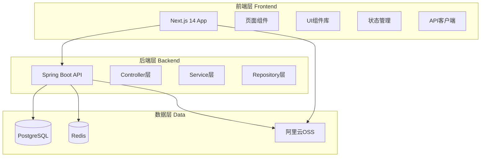
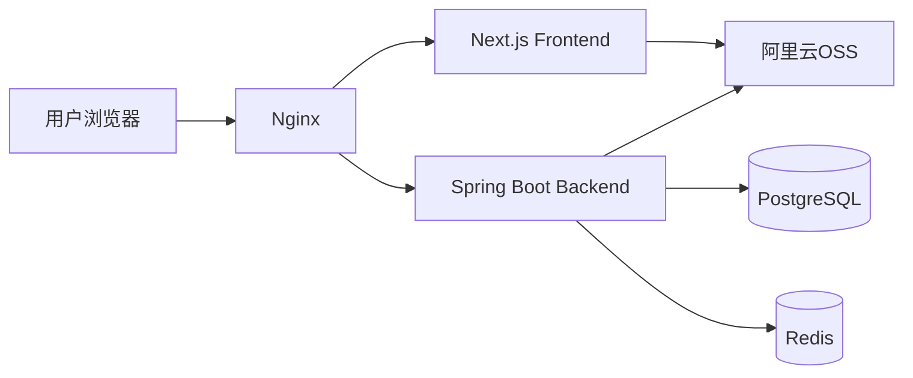

# Design Document

## Overview

漫骑游后台管理系统（CMS Admin System）是一个基于 Next.js 14 和 Spring Boot 3.2 构建的现代化内容管理平台。系统采用前后端分离架构，提供直观的可视化界面，让管理员能够轻松编辑网站内容和管理图片资源，无需编写代码。

### 设计目标

1. **易用性**：提供直观的用户界面，降低内容管理的学习成本
2. **安全性**：实现完善的权限控制和操作审计
3. **性能**：快速响应，支持大量图片和内容的高效管理
4. **可扩展性**：模块化设计，便于添加新功能
5. **可靠性**：版本控制和备份机制，防止数据丢失

### 核心特性

- **所见即所得编辑**：实时预览内容修改效果
- **多语言支持**：统一管理中英文内容
- **智能图片处理**：自动优化、格式转换、多尺寸生成
- **版本控制**：完整的修改历史和一键回滚
- **权限分级**：灵活的角色权限管理
- **操作审计**：详细的操作日志记录

## Architecture

### 系统架构图



### 技术栈选择

#### 前端技术栈
- **Next.js 14 (App Router)**：提供服务端渲染和静态生成能力
- **TypeScript**：类型安全，减少运行时错误
- **Tailwind CSS + shadcn/ui**：快速构建美观的UI
- **React Query**：高效的数据获取和缓存
- **Zustand**：轻量级状态管理
- **React Hook Form + Zod**：表单处理和验证
- **TipTap**：富文本编辑器

#### 后端技术栈
- **Spring Boot 3.2.x + Java 21**：最新LTS版本，性能提升和新特性
- **Spring Security + JWT**：安全认证
- **MyBatis-Plus**：简化数据库操作
- **PostgreSQL 16**：可靠的关系型数据库
- **Redis 7**：缓存和会话管理
- **阿里云OSS SDK**：对象存储服务

### 部署架构



- **Nginx**：反向代理、SSL终止、静态资源服务
- **PM2**：前端进程管理
- **Systemd**：后端服务管理
- **Docker**：容器化部署（可选）

## Components and Interfaces

### 前端组件架构

#### 1. 布局组件 (Layout Components)

**AdminLayout**
- 功能：后台管理系统的主布局
- 组成：侧边栏导航 + 顶部栏 + 内容区域
- 路由：包裹所有后台页面

**Sidebar**
- 功能：左侧导航菜单
- 菜单项：仪表盘、内容管理、图片管理、路线管理、商品管理、合作伙伴、系统设置、操作日志

**TopBar**
- 功能：顶部工具栏
- 包含：全局搜索、通知中心、用户菜单、语言切换

#### 2. 页面组件 (Page Components)

**DashboardPage**
- 路径：`/admin`
- 功能：展示系统概览和关键指标
- 组件：StatCard、RecentUpdates、TodoList

**ContentManagementPage**
- 路径：`/admin/content`
- 功能：管理所有页面的文本内容
- 组件：PageSelector、ContentList、ContentEditor

**AssetManagementPage**
- 路径：`/admin/assets`
- 功能：管理图片资源
- 组件：AssetGrid、AssetUploader、AssetDetail

**RouteManagementPage**
- 路径：`/admin/routes`
- 功能：管理骑游路线
- 组件：RouteList、RouteEditor、RoutePreview

**ProductManagementPage**
- 路径：`/admin/products`
- 功能：管理好物商品
- 组件：ProductList、ProductEditor

**PartnerManagementPage**
- 路径：`/admin/partners`
- 功能：管理合作伙伴
- 组件：PartnerList、PartnerEditor

**SettingsPage**
- 路径：`/admin/settings`
- 功能：系统设置
- 组件：GeneralSettings、SEOSettings、IntegrationSettings

**LogsPage**
- 路径：`/admin/logs`
- 功能：查看操作日志
- 组件：LogList、LogFilter、LogDetail

#### 3. 功能组件 (Feature Components)

**ContentEditor**
```typescript
interface ContentEditorProps {
  contentItem: ContentItem
  language: 'zh' | 'en'
  onSave: (content: string) => Promise<void>
  onCancel: () => void
}
```
- 功能：编辑单个内容项
- 支持：单行文本、多行文本、富文本
- 特性：实时字符计数、自动保存草稿

**RichTextEditor**
```typescript
interface RichTextEditorProps {
  value: string
  onChange: (value: string) => void
  placeholder?: string
  maxLength?: number
}
```
- 功能：富文本编辑
- 支持：加粗、斜体、链接、列表、图片插入
- 基于：TipTap编辑器

**AssetUploader**
```typescript
interface AssetUploaderProps {
  category: AssetCategory
  onUploadComplete: (assets: Asset[]) => void
  maxFiles?: number
  maxSize?: number // MB
  autoResize?: boolean // 自动调整尺寸
  targetSizes?: ImageSize[] // 目标尺寸配置
}

interface ImageSize {
  name: string // 'large', 'medium', 'small', 'thumbnail'
  width: number
  height?: number // 可选，保持宽高比
  quality?: number // 压缩质量 0-100
}
```
- 功能：图片上传和自动处理
- 支持：拖拽上传、批量上传、进度显示
- 验证：文件格式、大小、尺寸
- **自动处理**：
  - 智能裁剪和缩放到目标尺寸
  - 自动转换为WebP格式
  - 生成多个尺寸版本（原图、大、中、小、缩略图）
  - 保持宽高比或智能裁剪
  - 压缩优化（减少文件大小）

**AssetGrid**
```typescript
interface AssetGridProps {
  assets: Asset[]
  selectedIds: string[]
  onSelect: (ids: string[]) => void
  onReplace: (id: string, file: File) => Promise<void>
  onDelete: (ids: string[]) => Promise<void>
}
```
- 功能：图片网格展示
- 支持：多选、搜索、筛选、排序
- 操作：替换、删除、查看详情

**VersionHistory**
```typescript
interface VersionHistoryProps {
  contentId: string
  versions: ContentVersion[]
  onRestore: (versionId: string) => Promise<void>
}
```
- 功能：版本历史查看
- 支持：版本对比、差异高亮、一键恢复

**PreviewModal**
```typescript
interface PreviewModalProps {
  page: PageType
  content: Record<string, string>
  isOpen: boolean
  onClose: () => void
}
```
- 功能：内容预览
- 特性：使用真实样式、响应式预览

#### 4. UI组件 (UI Components)

基于 shadcn/ui，包括：
- Button、Input、Textarea、Select
- Dialog、Sheet、Popover、Tooltip
- Table、Card、Badge、Avatar
- Form、Checkbox、Radio、Switch
- Toast、Alert、Progress、Skeleton

### 后端API接口

#### 1. 认证接口 (Authentication API)

**POST /api/admin/auth/login**
```typescript
Request: {
  username: string
  password: string
}
Response: {
  token: string
  user: AdminUser
  expiresIn: number
}
```

**POST /api/admin/auth/logout**
```typescript
Request: { token: string }
Response: { success: boolean }
```

**GET /api/admin/auth/me**
```typescript
Response: {
  user: AdminUser
  permissions: string[]
}
```

#### 2. 内容管理接口 (Content API)

**GET /api/admin/content/pages**
```typescript
Response: {
  pages: Page[]
}
```

**GET /api/admin/content/pages/:pageId**
```typescript
Response: {
  page: Page
  contentItems: ContentItem[]
}
```

**PUT /api/admin/content/items/:itemId**
```typescript
Request: {
  zh: string
  en: string
}
Response: {
  contentItem: ContentItem
  version: ContentVersion
}
```

**GET /api/admin/content/items/:itemId/versions**
```typescript
Response: {
  versions: ContentVersion[]
}
```

**POST /api/admin/content/items/:itemId/restore**
```typescript
Request: { versionId: string }
Response: { contentItem: ContentItem }
```

#### 3. 资源管理接口 (Asset API)

**GET /api/admin/assets**
```typescript
Query: {
  category?: string
  search?: string
  page?: number
  limit?: number
}
Response: {
  assets: Asset[]
  total: number
  page: number
  limit: number
}
```

**POST /api/admin/assets/upload**
```typescript
Request: FormData {
  files: File[]
  category: string
  autoProcess?: boolean // 是否自动处理图片，默认true
  targetSizes?: ImageSize[] // 自定义目标尺寸
}
Response: {
  assets: Asset[] // 包含原图和所有生成的尺寸版本
  processedSizes: {
    original: string // 原图URL
    large: string // 大图URL (1920px)
    medium: string // 中图URL (1024px)
    small: string // 小图URL (640px)
    thumbnail: string // 缩略图URL (200px)
  }
}
```

**图片自动处理说明**：
- 上传后自动生成5个尺寸版本
- 自动转换为WebP格式（减少70%文件大小）
- 智能裁剪保持主体内容
- 压缩优化（质量85%）
- 所有版本上传到阿里云OSS

**PUT /api/admin/assets/:assetId**
```typescript
Request: FormData {
  file: File
}
Response: {
  asset: Asset
}
```

**DELETE /api/admin/assets/:assetId**
```typescript
Response: { success: boolean }
```

**GET /api/admin/assets/:assetId/usage**
```typescript
Response: {
  usages: AssetUsage[]
}
```

#### 4. 路线管理接口 (Route API)

**GET /api/admin/routes**
```typescript
Query: {
  status?: 'draft' | 'published' | 'archived'
  search?: string
  page?: number
  limit?: number
}
Response: {
  routes: Route[]
  total: number
}
```

**POST /api/admin/routes**
```typescript
Request: {
  name: { zh: string, en: string }
  description: { zh: string, en: string }
  distance: number
  difficulty: string
  price: number
  images: string[]
  // ... other fields
}
Response: {
  route: Route
}
```

**PUT /api/admin/routes/:routeId**
```typescript
Request: Partial<Route>
Response: { route: Route }
```

**DELETE /api/admin/routes/:routeId**
```typescript
Response: { success: boolean }
```

**POST /api/admin/routes/:routeId/publish**
```typescript
Response: { route: Route }
```

#### 5. 商品管理接口 (Product API)

**GET /api/admin/products**
**POST /api/admin/products**
**PUT /api/admin/products/:productId**
**DELETE /api/admin/products/:productId**

（接口结构类似 Route API）

#### 6. 合作伙伴接口 (Partner API)

**GET /api/admin/partners**
**POST /api/admin/partners**
**PUT /api/admin/partners/:partnerId**
**DELETE /api/admin/partners/:partnerId**
**PUT /api/admin/partners/reorder**
```typescript
Request: {
  partnerIds: string[]
}
Response: { success: boolean }
```

#### 7. 系统设置接口 (Settings API)

**GET /api/admin/settings**
```typescript
Response: {
  settings: SystemSettings
}
```

**PUT /api/admin/settings**
```typescript
Request: Partial<SystemSettings>
Response: { settings: SystemSettings }
```

#### 8. 统计接口 (Statistics API)

**GET /api/admin/statistics/dashboard**
```typescript
Response: {
  totalPages: number
  totalAssets: number
  totalRoutes: number
  totalProducts: number
  recentUpdates: Update[]
  todoItems: TodoItem[]
}
```

**GET /api/admin/statistics/routes/:routeId**
```typescript
Response: {
  views: number
  bookings: number
  revenue: number
}
```

#### 9. 日志接口 (Log API)

**GET /api/admin/logs**
```typescript
Query: {
  startDate?: string
  endDate?: string
  userId?: string
  action?: string
  page?: number
  limit?: number
}
Response: {
  logs: Log[]
  total: number
}
```

**GET /api/admin/logs/:logId**
```typescript
Response: {
  log: Log
}
```

## Data Models

### 数据库表设计

#### 1. 管理员表 (admin_users)

```sql
CREATE TABLE admin_users (
  id BIGSERIAL PRIMARY KEY,
  username VARCHAR(50) UNIQUE NOT NULL,
  password_hash VARCHAR(255) NOT NULL,
  email VARCHAR(100) UNIQUE NOT NULL,
  full_name VARCHAR(100),
  role VARCHAR(20) NOT NULL, -- 'super_admin' | 'content_editor'
  is_active BOOLEAN DEFAULT true,
  last_login_at TIMESTAMP,
  created_at TIMESTAMP DEFAULT CURRENT_TIMESTAMP,
  updated_at TIMESTAMP DEFAULT CURRENT_TIMESTAMP
);

CREATE INDEX idx_admin_users_username ON admin_users(username);
CREATE INDEX idx_admin_users_role ON admin_users(role);
```

#### 2. 页面表 (pages)

```sql
CREATE TABLE pages (
  id BIGSERIAL PRIMARY KEY,
  slug VARCHAR(50) UNIQUE NOT NULL, -- 'home', 'ebike', 'routes', etc.
  name_zh VARCHAR(100) NOT NULL,
  name_en VARCHAR(100) NOT NULL,
  description TEXT,
  is_active BOOLEAN DEFAULT true,
  created_at TIMESTAMP DEFAULT CURRENT_TIMESTAMP,
  updated_at TIMESTAMP DEFAULT CURRENT_TIMESTAMP
);
```

#### 3. 内容项表 (content_items)

```sql
CREATE TABLE content_items (
  id BIGSERIAL PRIMARY KEY,
  page_id BIGINT REFERENCES pages(id) ON DELETE CASCADE,
  field_key VARCHAR(100) NOT NULL, -- 'hero.title', 'hero.subtitle', etc.
  field_type VARCHAR(20) NOT NULL, -- 'text', 'textarea', 'richtext'
  content_zh TEXT,
  content_en TEXT,
  max_length INT,
  is_required BOOLEAN DEFAULT false,
  display_order INT DEFAULT 0,
  created_at TIMESTAMP DEFAULT CURRENT_TIMESTAMP,
  updated_at TIMESTAMP DEFAULT CURRENT_TIMESTAMP,
  UNIQUE(page_id, field_key)
);

CREATE INDEX idx_content_items_page_id ON content_items(page_id);
```

#### 4. 内容版本表 (content_versions)

```sql
CREATE TABLE content_versions (
  id BIGSERIAL PRIMARY KEY,
  content_item_id BIGINT REFERENCES content_items(id) ON DELETE CASCADE,
  version_number INT NOT NULL,
  content_zh TEXT,
  content_en TEXT,
  changed_by BIGINT REFERENCES admin_users(id),
  change_summary VARCHAR(255),
  created_at TIMESTAMP DEFAULT CURRENT_TIMESTAMP
);

CREATE INDEX idx_content_versions_item_id ON content_versions(content_item_id);
CREATE INDEX idx_content_versions_created_at ON content_versions(created_at DESC);
```

#### 5. 资源表 (assets)

```sql
CREATE TABLE assets (
  id BIGSERIAL PRIMARY KEY,
  category VARCHAR(50) NOT NULL, -- 'hero', 'brand', 'ebike', 'route', etc.
  original_filename VARCHAR(255) NOT NULL,
  file_key VARCHAR(255) UNIQUE NOT NULL, -- OSS key
  file_url VARCHAR(500) NOT NULL, -- 原图URL
  
  -- 自动生成的多尺寸版本
  large_url VARCHAR(500), -- 1920px
  medium_url VARCHAR(500), -- 1024px
  small_url VARCHAR(500), -- 640px
  thumbnail_url VARCHAR(500), -- 200px
  
  file_size BIGINT NOT NULL, -- bytes (原图)
  width INT, -- 原图宽度
  height INT, -- 原图高度
  mime_type VARCHAR(50),
  
  -- 处理信息
  is_processed BOOLEAN DEFAULT false, -- 是否已处理
  webp_converted BOOLEAN DEFAULT false, -- 是否已转WebP
  processing_status VARCHAR(20), -- 'pending', 'processing', 'completed', 'failed'
  
  alt_text_zh VARCHAR(255),
  alt_text_en VARCHAR(255),
  uploaded_by BIGINT REFERENCES admin_users(id),
  created_at TIMESTAMP DEFAULT CURRENT_TIMESTAMP,
  updated_at TIMESTAMP DEFAULT CURRENT_TIMESTAMP
);

CREATE INDEX idx_assets_category ON assets(category);
CREATE INDEX idx_assets_created_at ON assets(created_at DESC);
CREATE INDEX idx_assets_processing_status ON assets(processing_status);
```

#### 6. 资源使用表 (asset_usages)

```sql
CREATE TABLE asset_usages (
  id BIGSERIAL PRIMARY KEY,
  asset_id BIGINT REFERENCES assets(id) ON DELETE CASCADE,
  usage_type VARCHAR(50) NOT NULL, -- 'page_content', 'route', 'product', etc.
  usage_id BIGINT NOT NULL, -- ID of the using entity
  field_name VARCHAR(100), -- Which field uses this asset
  created_at TIMESTAMP DEFAULT CURRENT_TIMESTAMP
);

CREATE INDEX idx_asset_usages_asset_id ON asset_usages(asset_id);
CREATE INDEX idx_asset_usages_usage ON asset_usages(usage_type, usage_id);
```

#### 7. 路线表 (routes)

```sql
CREATE TABLE routes (
  id BIGSERIAL PRIMARY KEY,
  name_zh VARCHAR(200) NOT NULL,
  name_en VARCHAR(200) NOT NULL,
  slug VARCHAR(100) UNIQUE NOT NULL,
  short_desc_zh TEXT,
  short_desc_en TEXT,
  full_desc_zh TEXT,
  full_desc_en TEXT,
  distance DECIMAL(10, 2), -- km
  difficulty VARCHAR(20), -- 'easy', 'medium', 'hard'
  duration INT, -- minutes
  price DECIMAL(10, 2),
  cover_image_id BIGINT REFERENCES assets(id),
  status VARCHAR(20) DEFAULT 'draft', -- 'draft', 'published', 'archived'
  is_featured BOOLEAN DEFAULT false,
  view_count INT DEFAULT 0,
  booking_count INT DEFAULT 0,
  created_by BIGINT REFERENCES admin_users(id),
  created_at TIMESTAMP DEFAULT CURRENT_TIMESTAMP,
  updated_at TIMESTAMP DEFAULT CURRENT_TIMESTAMP
);

CREATE INDEX idx_routes_status ON routes(status);
CREATE INDEX idx_routes_featured ON routes(is_featured);
CREATE INDEX idx_routes_slug ON routes(slug);
```

#### 8. 路线图片表 (route_images)

```sql
CREATE TABLE route_images (
  id BIGSERIAL PRIMARY KEY,
  route_id BIGINT REFERENCES routes(id) ON DELETE CASCADE,
  asset_id BIGINT REFERENCES assets(id) ON DELETE CASCADE,
  display_order INT DEFAULT 0,
  created_at TIMESTAMP DEFAULT CURRENT_TIMESTAMP
);

CREATE INDEX idx_route_images_route_id ON route_images(route_id);
```

#### 9. 路线亮点表 (route_highlights)

```sql
CREATE TABLE route_highlights (
  id BIGSERIAL PRIMARY KEY,
  route_id BIGINT REFERENCES routes(id) ON DELETE CASCADE,
  title_zh VARCHAR(100) NOT NULL,
  title_en VARCHAR(100) NOT NULL,
  description_zh TEXT,
  description_en TEXT,
  display_order INT DEFAULT 0,
  created_at TIMESTAMP DEFAULT CURRENT_TIMESTAMP
);
```

#### 10. 商品表 (products)

```sql
CREATE TABLE products (
  id BIGSERIAL PRIMARY KEY,
  name_zh VARCHAR(200) NOT NULL,
  name_en VARCHAR(200) NOT NULL,
  slug VARCHAR(100) UNIQUE NOT NULL,
  short_desc_zh TEXT,
  short_desc_en TEXT,
  full_desc_zh TEXT,
  full_desc_en TEXT,
  category VARCHAR(50), -- '衣', '食', '住', '行', '乐'
  original_price DECIMAL(10, 2),
  current_price DECIMAL(10, 2),
  stock_quantity INT DEFAULT 0,
  cover_image_id BIGINT REFERENCES assets(id),
  merchant_name VARCHAR(200),
  merchant_address VARCHAR(500),
  merchant_contact VARCHAR(100),
  status VARCHAR(20) DEFAULT 'draft', -- 'draft', 'active', 'inactive'
  view_count INT DEFAULT 0,
  sale_count INT DEFAULT 0,
  created_by BIGINT REFERENCES admin_users(id),
  created_at TIMESTAMP DEFAULT CURRENT_TIMESTAMP,
  updated_at TIMESTAMP DEFAULT CURRENT_TIMESTAMP
);

CREATE INDEX idx_products_status ON products(status);
CREATE INDEX idx_products_category ON products(category);
```

#### 11. 商品图片表 (product_images)

```sql
CREATE TABLE product_images (
  id BIGSERIAL PRIMARY KEY,
  product_id BIGINT REFERENCES products(id) ON DELETE CASCADE,
  asset_id BIGINT REFERENCES assets(id) ON DELETE CASCADE,
  display_order INT DEFAULT 0,
  created_at TIMESTAMP DEFAULT CURRENT_TIMESTAMP
);
```

#### 12. 合作伙伴表 (partners)

```sql
CREATE TABLE partners (
  id BIGSERIAL PRIMARY KEY,
  name VARCHAR(200) NOT NULL,
  type VARCHAR(50) NOT NULL, -- 'brand', 'scenic_area'
  description_zh TEXT,
  description_en TEXT,
  logo_id BIGINT REFERENCES assets(id),
  website_url VARCHAR(500),
  display_order INT DEFAULT 0,
  is_active BOOLEAN DEFAULT true,
  created_at TIMESTAMP DEFAULT CURRENT_TIMESTAMP,
  updated_at TIMESTAMP DEFAULT CURRENT_TIMESTAMP
);

CREATE INDEX idx_partners_type ON partners(type);
CREATE INDEX idx_partners_order ON partners(display_order);
```

#### 13. 系统设置表 (system_settings)

```sql
CREATE TABLE system_settings (
  id BIGSERIAL PRIMARY KEY,
  setting_key VARCHAR(100) UNIQUE NOT NULL,
  setting_value TEXT,
  setting_type VARCHAR(20), -- 'string', 'number', 'boolean', 'json'
  description TEXT,
  updated_by BIGINT REFERENCES admin_users(id),
  updated_at TIMESTAMP DEFAULT CURRENT_TIMESTAMP
);
```

#### 14. 操作日志表 (operation_logs)

```sql
CREATE TABLE operation_logs (
  id BIGSERIAL PRIMARY KEY,
  user_id BIGINT REFERENCES admin_users(id),
  action VARCHAR(50) NOT NULL, -- 'login', 'create', 'update', 'delete', 'publish'
  resource_type VARCHAR(50), -- 'content', 'asset', 'route', 'product', etc.
  resource_id BIGINT,
  details JSONB, -- Store before/after values
  ip_address VARCHAR(45),
  user_agent TEXT,
  created_at TIMESTAMP DEFAULT CURRENT_TIMESTAMP
);

CREATE INDEX idx_operation_logs_user_id ON operation_logs(user_id);
CREATE INDEX idx_operation_logs_action ON operation_logs(action);
CREATE INDEX idx_operation_logs_created_at ON operation_logs(created_at DESC);
```

### TypeScript类型定义

```typescript
// Admin User
interface AdminUser {
  id: string
  username: string
  email: string
  fullName: string
  role: 'super_admin' | 'content_editor'
  isActive: boolean
  lastLoginAt: string
  createdAt: string
  updatedAt: string
}

// Page
interface Page {
  id: string
  slug: string
  nameZh: string
  nameEn: string
  description: string
  isActive: boolean
  createdAt: string
  updatedAt: string
}

// Content Item
interface ContentItem {
  id: string
  pageId: string
  fieldKey: string
  fieldType: 'text' | 'textarea' | 'richtext'
  contentZh: string
  contentEn: string
  maxLength?: number
  isRequired: boolean
  displayOrder: number
  createdAt: string
  updatedAt: string
}

// Content Version
interface ContentVersion {
  id: string
  contentItemId: string
  versionNumber: number
  contentZh: string
  contentEn: string
  changedBy: string
  changeSummary: string
  createdAt: string
}

// Asset
interface Asset {
  id: string
  category: string
  originalFilename: string
  fileKey: string
  fileUrl: string // 原图
  largeUrl: string // 1920px
  mediumUrl: string // 1024px
  smallUrl: string // 640px
  thumbnailUrl: string // 200px
  fileSize: number
  width: number
  height: number
  mimeType: string
  isProcessed: boolean
  webpConverted: boolean
  processingStatus: 'pending' | 'processing' | 'completed' | 'failed'
  altTextZh: string
  altTextEn: string
  uploadedBy: string
  createdAt: string
  updatedAt: string
}

// Image Processing Configuration
interface ImageProcessingConfig {
  sizes: {
    large: { width: 1920, quality: 85 }
    medium: { width: 1024, quality: 85 }
    small: { width: 640, quality: 85 }
    thumbnail: { width: 200, quality: 80 }
  }
  format: 'webp'
  preserveAspectRatio: true
  smartCrop: true // 智能裁剪保持主体
}

// Asset Usage
interface AssetUsage {
  id: string
  assetId: string
  usageType: string
  usageId: string
  fieldName: string
  createdAt: string
}

// Route
interface Route {
  id: string
  nameZh: string
  nameEn: string
  slug: string
  shortDescZh: string
  shortDescEn: string
  fullDescZh: string
  fullDescEn: string
  distance: number
  difficulty: 'easy' | 'medium' | 'hard'
  duration: number
  price: number
  coverImageId: string
  status: 'draft' | 'published' | 'archived'
  isFeatured: boolean
  viewCount: number
  bookingCount: number
  createdBy: string
  createdAt: string
  updatedAt: string
}

// Product
interface Product {
  id: string
  nameZh: string
  nameEn: string
  slug: string
  shortDescZh: string
  shortDescEn: string
  fullDescZh: string
  fullDescEn: string
  category: string
  originalPrice: number
  currentPrice: number
  stockQuantity: number
  coverImageId: string
  merchantName: string
  merchantAddress: string
  merchantContact: string
  status: 'draft' | 'active' | 'inactive'
  viewCount: number
  saleCount: number
  createdBy: string
  createdAt: string
  updatedAt: string
}

// Partner
interface Partner {
  id: string
  name: string
  type: 'brand' | 'scenic_area'
  descriptionZh: string
  descriptionEn: string
  logoId: string
  websiteUrl: string
  displayOrder: number
  isActive: boolean
  createdAt: string
  updatedAt: string
}

// System Settings
interface SystemSettings {
  siteName: string
  siteLogoId: string
  siteFaviconId: string
  contactEmail: string
  contactPhone: string
  seoTitle: string
  seoDescription: string
  seoKeywords: string
  wechatQrCodeId: string
  weiboUrl: string
  douyinUrl: string
  ossAccessKeyId: string
  ossAccessKeySecret: string
  ossBucket: string
  ossRegion: string
  translationApiKey: string
  smtpHost: string
  smtpPort: number
  smtpUsername: string
  smtpPassword: string
}

// Operation Log
interface OperationLog {
  id: string
  userId: string
  action: string
  resourceType: string
  resourceId: string
  details: Record<string, any>
  ipAddress: string
  userAgent: string
  createdAt: string
}
```

## Correctness Properties

*A property is a characteristic or behavior that should hold true across all valid executions of a system—essentially, a formal statement about what the system should do. Properties serve as the bridge between human-readable specifications and machine-verifiable correctness guarantees.*

在开始编写正确性属性之前，我需要先进行接受标准的可测试性分析。


### Property 1: 认证成功返回令牌
*For any* valid admin credentials (username and password), authentication should succeed and return a valid JWT token with user information.
**Validates: Requirements 1.1, 1.2**

### Property 2: 登录日志完整性
*For any* login attempt (successful or failed), the system should create a log entry containing timestamp, IP address, and user agent information.
**Validates: Requirements 1.7**

### Property 3: 内容检索完整性
*For any* page in the system, retrieving its content items should return all content items associated with that page.
**Validates: Requirements 2.2**

### Property 4: 内容保存往返一致性
*For any* content item, saving content (in both languages) and then retrieving it should return the exact same content that was saved.
**Validates: Requirements 2.6, 3.6**

### Property 5: 图片处理完整性
*For any* successfully uploaded image, the system should automatically generate all required sizes (original, large, medium, small, thumbnail) and convert to WebP format, with all versions accessible via their respective URLs.
**Validates: Requirements 4.6, 4.7**

### Property 6: 资源引用完整性
*For any* asset that is currently in use, attempting to delete it should fail with a warning about existing usages.
**Validates: Requirements 4.9**

### Property 7: 发布操作日志记录
*For any* publish action, the system should create an operation log entry with the publish details.
**Validates: Requirements 5.6**

### Property 8: 版本自动创建
*For any* content modification, the system should automatically create a new version record with the previous content.
**Validates: Requirements 6.1**

### Property 9: 版本恢复一致性
*For any* content version, restoring to that version should create a new version record and the content should match the restored version.
**Validates: Requirements 6.7**

### Property 10: 路线创建完整性
*For any* route with all required fields, creating the route should succeed and all fields should be persisted correctly.
**Validates: Requirements 8.2**

### Property 11: 并发编辑检测
*For any* content item, if two users attempt to save changes simultaneously, the second save should detect the conflict and warn the user.
**Validates: Requirements 15.6**

### Property 12: 导入事务原子性
*For any* batch import operation, if the import fails at any point, the system should rollback all changes and leave no partial data.
**Validates: Requirements 16.6**

## Error Handling

### 错误分类

#### 1. 认证错误 (Authentication Errors)
- **401 Unauthorized**: 未登录或令牌无效
- **403 Forbidden**: 权限不足
- **429 Too Many Requests**: 登录尝试次数过多

#### 2. 验证错误 (Validation Errors)
- **400 Bad Request**: 请求参数格式错误
- **422 Unprocessable Entity**: 业务规则验证失败
  - 内容超过最大长度
  - 必填字段缺失
  - 文件格式不支持
  - 文件大小超限

#### 3. 资源错误 (Resource Errors)
- **404 Not Found**: 资源不存在
- **409 Conflict**: 资源冲突
  - 并发编辑冲突
  - 唯一性约束冲突（如slug重复）
  - 资源正在使用中无法删除

#### 4. 服务器错误 (Server Errors)
- **500 Internal Server Error**: 服务器内部错误
- **503 Service Unavailable**: 服务暂时不可用（如OSS服务故障）

### 错误响应格式

```typescript
interface ErrorResponse {
  code: number
  message: string
  details?: Record<string, string[]> // Field-level errors
  timestamp: string
  path: string
}
```

示例：
```json
{
  "code": 422,
  "message": "Validation failed",
  "details": {
    "nameZh": ["内容不能为空", "内容长度不能超过200个字符"],
    "price": ["价格必须大于0"]
  },
  "timestamp": "2026-02-02T10:30:00Z",
  "path": "/api/admin/routes"
}
```

### 错误处理策略

#### 前端错误处理
1. **全局错误拦截器**：捕获所有API错误
2. **Toast通知**：显示用户友好的错误消息
3. **表单字段错误**：在对应字段下显示验证错误
4. **重试机制**：网络错误自动重试3次
5. **降级处理**：关键功能失败时提供备选方案

#### 后端错误处理
1. **统一异常处理器**：@ControllerAdvice捕获所有异常
2. **业务异常**：自定义异常类（ValidationException, ResourceNotFoundException等）
3. **日志记录**：记录所有错误到日志系统
4. **事务回滚**：数据库操作失败自动回滚
5. **优雅降级**：第三方服务失败时使用备选方案

### 特殊场景处理

#### 图片上传失败
- 显示具体失败原因（格式、大小、网络）
- 允许重新上传
- 保留已成功上传的图片

#### 并发编辑冲突
- 检测内容版本号
- 显示冲突对比界面
- 允许用户选择：覆盖、合并、取消

#### OSS服务故障
- 降级到本地存储
- 显示警告提示
- 后台自动同步到OSS

#### 数据库连接失败
- 使用Redis缓存的数据
- 显示只读模式提示
- 自动重连机制

## Testing Strategy

### 测试方法论

本系统采用**双重测试策略**：单元测试验证具体示例和边界情况，属性测试验证通用规则在所有输入下的正确性。两者互补，共同确保系统的全面正确性。

### 单元测试 (Unit Tests)

#### 前端单元测试
使用 **Vitest + Testing Library**

**测试范围**：
- UI组件渲染和交互
- 表单验证逻辑
- 状态管理（Zustand stores）
- 工具函数

**示例测试**：
```typescript
// ContentEditor.test.tsx
describe('ContentEditor', () => {
  it('should display character count', () => {
    render(<ContentEditor maxLength={100} />)
    const input = screen.getByRole('textbox')
    fireEvent.change(input, { target: { value: 'Hello' } })
    expect(screen.getByText('5 / 100')).toBeInTheDocument()
  })

  it('should warn when exceeding max length', () => {
    render(<ContentEditor maxLength={10} />)
    const input = screen.getByRole('textbox')
    fireEvent.change(input, { target: { value: 'This is too long' } })
    expect(screen.getByText(/超出建议长度/)).toBeInTheDocument()
  })

  it('should call onSave with correct data', async () => {
    const onSave = vi.fn()
    render(<ContentEditor onSave={onSave} />)
    const input = screen.getByRole('textbox')
    fireEvent.change(input, { target: { value: 'New content' } })
    fireEvent.click(screen.getByText('保存'))
    await waitFor(() => {
      expect(onSave).toHaveBeenCalledWith('New content')
    })
  })
})
```

#### 后端单元测试
使用 **JUnit 5 + Mockito**

**测试范围**：
- Service层业务逻辑
- Controller层请求处理
- 数据验证逻辑
- 工具类方法

**示例测试**：
```java
@SpringBootTest
class ContentServiceTest {
    
    @Autowired
    private ContentService contentService;
    
    @MockBean
    private ContentRepository contentRepository;
    
    @Test
    void shouldSaveContentWithBothLanguages() {
        // Given
        ContentItem item = new ContentItem();
        item.setContentZh("中文内容");
        item.setContentEn("English content");
        
        when(contentRepository.save(any())).thenReturn(item);
        
        // When
        ContentItem saved = contentService.saveContent(item);
        
        // Then
        assertNotNull(saved.getContentZh());
        assertNotNull(saved.getContentEn());
        verify(contentRepository).save(item);
    }
    
    @Test
    void shouldThrowExceptionWhenContentTooLong() {
        // Given
        ContentItem item = new ContentItem();
        item.setMaxLength(100);
        item.setContentZh("很长的内容".repeat(50)); // > 100 chars
        
        // When & Then
        assertThrows(ValidationException.class, () -> {
            contentService.saveContent(item);
        });
    }
}
```

### 属性测试 (Property-Based Tests)

#### 测试框架
- **前端**: fast-check (JavaScript/TypeScript)
- **后端**: jqwik (Java)

#### 测试配置
- 每个属性测试运行 **最少100次迭代**
- 使用智能生成器约束输入空间
- 每个测试标注对应的设计属性

#### 前端属性测试示例

```typescript
// content.property.test.ts
import fc from 'fast-check'

/**
 * Feature: cms-admin-system, Property 4: 内容保存往返一致性
 * For any content item, saving content and then retrieving it 
 * should return the exact same content.
 */
describe('Property 4: Content Round Trip', () => {
  it('should preserve content through save and retrieve', async () => {
    await fc.assert(
      fc.asyncProperty(
        fc.record({
          contentZh: fc.string({ minLength: 1, maxLength: 1000 }),
          contentEn: fc.string({ minLength: 1, maxLength: 1000 }),
          fieldKey: fc.constantFrom('hero.title', 'hero.subtitle', 'section.description')
        }),
        async (content) => {
          // Save content
          const saved = await api.saveContent(content)
          
          // Retrieve content
          const retrieved = await api.getContent(saved.id)
          
          // Verify round trip
          expect(retrieved.contentZh).toBe(content.contentZh)
          expect(retrieved.contentEn).toBe(content.contentEn)
        }
      ),
      { numRuns: 100 }
    )
  })
})

/**
 * Feature: cms-admin-system, Property 8: 版本自动创建
 * For any content modification, a new version should be created.
 */
describe('Property 8: Version Auto Creation', () => {
  it('should create version on every modification', async () => {
    await fc.assert(
      fc.asyncProperty(
        fc.string({ minLength: 1, maxLength: 500 }),
        fc.string({ minLength: 1, maxLength: 500 }),
        async (initialContent, modifiedContent) => {
          // Create initial content
          const item = await api.createContent({ contentZh: initialContent })
          const initialVersions = await api.getVersions(item.id)
          
          // Modify content
          await api.updateContent(item.id, { contentZh: modifiedContent })
          const afterVersions = await api.getVersions(item.id)
          
          // Verify new version created
          expect(afterVersions.length).toBe(initialVersions.length + 1)
          expect(afterVersions[0].contentZh).toBe(modifiedContent)
        }
      ),
      { numRuns: 100 }
    )
  })
})
```

#### 后端属性测试示例

```java
/**
 * Feature: cms-admin-system, Property 5: 图片处理完整性
 * For any uploaded image, all required sizes should be generated.
 */
@Property
void shouldGenerateAllImageSizes(@ForAll("validImages") MultipartFile image) {
    // When
    Asset asset = assetService.uploadImage(image, "test-category");
    
    // Then
    assertNotNull(asset.getFileUrl()); // Original
    assertNotNull(asset.getThumbnailUrl()); // Thumbnail
    
    // Verify all sizes exist in OSS
    List<String> sizes = Arrays.asList("large", "medium", "small");
    for (String size : sizes) {
        String sizeUrl = asset.getFileUrl().replace(".webp", "_" + size + ".webp");
        assertTrue(ossService.exists(sizeUrl), 
            "Size " + size + " should exist");
    }
    
    // Verify WebP format
    assertTrue(asset.getFileUrl().endsWith(".webp"), 
        "Should be converted to WebP");
}

@Provide
Arbitrary<MultipartFile> validImages() {
    return Arbitraries.integers().between(100, 2000)
        .flatMap(size -> {
            // Generate valid image data
            byte[] imageData = generateTestImage(size, size);
            return Arbitraries.just(
                new MockMultipartFile("file", "test.jpg", "image/jpeg", imageData)
            );
        });
}

/**
 * Feature: cms-admin-system, Property 6: 资源引用完整性
 * For any asset in use, deletion should fail.
 */
@Property
void shouldPreventDeletionOfUsedAssets(
    @ForAll("validAssets") Asset asset,
    @ForAll("usageTypes") String usageType
) {
    // Given: Asset is in use
    assetUsageRepository.save(new AssetUsage(asset.getId(), usageType, 1L));
    
    // When & Then: Deletion should fail
    assertThrows(ResourceInUseException.class, () -> {
        assetService.deleteAsset(asset.getId());
    });
    
    // Verify asset still exists
    assertTrue(assetRepository.existsById(asset.getId()));
}

/**
 * Feature: cms-admin-system, Property 11: 并发编辑检测
 * For any content, concurrent edits should be detected.
 */
@Property
void shouldDetectConcurrentEdits(
    @ForAll("contentItems") ContentItem item,
    @ForAll String user1Content,
    @ForAll String user2Content
) throws Exception {
    // Given: Two users load the same content
    ContentItem user1Item = contentService.getById(item.getId());
    ContentItem user2Item = contentService.getById(item.getId());
    
    // When: User 1 saves first
    user1Item.setContentZh(user1Content);
    contentService.save(user1Item);
    
    // Then: User 2's save should detect conflict
    user2Item.setContentZh(user2Content);
    assertThrows(ConcurrentModificationException.class, () -> {
        contentService.save(user2Item);
    });
}
```

### 集成测试 (Integration Tests)

#### API集成测试
使用 **Spring Boot Test + TestContainers**

```java
@SpringBootTest(webEnvironment = WebEnvironment.RANDOM_PORT)
@Testcontainers
class ContentApiIntegrationTest {
    
    @Container
    static PostgreSQLContainer<?> postgres = new PostgreSQLContainer<>("postgres:16");
    
    @Autowired
    private TestRestTemplate restTemplate;
    
    @Test
    void shouldCreateAndRetrieveContent() {
        // Create content
        ContentRequest request = new ContentRequest("标题", "Title");
        ResponseEntity<ContentItem> createResponse = restTemplate
            .postForEntity("/api/admin/content/items", request, ContentItem.class);
        
        assertEquals(HttpStatus.CREATED, createResponse.getStatusCode());
        
        // Retrieve content
        String itemId = createResponse.getBody().getId();
        ResponseEntity<ContentItem> getResponse = restTemplate
            .getForEntity("/api/admin/content/items/" + itemId, ContentItem.class);
        
        assertEquals(HttpStatus.OK, getResponse.getStatusCode());
        assertEquals("标题", getResponse.getBody().getContentZh());
    }
}
```

### 端到端测试 (E2E Tests)

使用 **Playwright** 进行关键用户流程测试：

```typescript
// e2e/content-management.spec.ts
test('should edit and publish content', async ({ page }) => {
  // Login
  await page.goto('/admin/login')
  await page.fill('[name="username"]', 'admin')
  await page.fill('[name="password"]', 'password')
  await page.click('button[type="submit"]')
  
  // Navigate to content management
  await page.click('text=内容管理')
  await page.click('text=首页')
  
  // Edit content
  await page.click('text=Hero标题')
  await page.fill('[name="contentZh"]', '新的标题')
  await page.click('text=保存')
  
  // Preview
  await page.click('text=预览')
  const previewPage = await page.waitForEvent('popup')
  await expect(previewPage.locator('h1')).toHaveText('新的标题')
  
  // Publish
  await page.click('text=发布')
  await page.click('text=确认')
  await expect(page.locator('.toast')).toHaveText('发布成功')
})
```

### 性能测试

#### 负载测试
使用 **Apache JMeter** 或 **k6**

测试场景：
- 100个并发用户同时编辑内容
- 批量上传50张图片
- 1000次内容查询请求

性能目标：
- API响应时间 < 200ms (P95)
- 图片上传处理时间 < 5s
- 系统支持100个并发用户

#### 前端性能测试
使用 **Lighthouse CI**

性能目标：
- Performance Score > 90
- First Contentful Paint < 1.5s
- Time to Interactive < 3s

### 测试覆盖率目标

- **单元测试覆盖率**: > 80%
- **属性测试**: 所有12个正确性属性
- **集成测试**: 所有API端点
- **E2E测试**: 5个关键用户流程

### 持续集成

```yaml
# .github/workflows/test.yml
name: Test

on: [push, pull_request]

jobs:
  frontend-test:
    runs-on: ubuntu-latest
    steps:
      - uses: actions/checkout@v3
      - uses: actions/setup-node@v3
      - run: npm ci
      - run: npm run test
      - run: npm run test:e2e
      
  backend-test:
    runs-on: ubuntu-latest
    steps:
      - uses: actions/checkout@v3
      - uses: actions/setup-java@v3
        with:
          java-version: '21'
      - run: ./mvnw test
      - run: ./mvnw verify
```

## Security Considerations

### 认证与授权

1. **JWT令牌**：
   - 使用RS256算法签名
   - 令牌有效期30分钟
   - Refresh token有效期7天
   - 存储在HttpOnly Cookie中

2. **密码安全**：
   - 使用BCrypt哈希（强度12）
   - 强制密码复杂度要求
   - 定期提示修改密码

3. **权限控制**：
   - 基于角色的访问控制（RBAC）
   - 细粒度权限检查
   - API级别的权限验证

### 输入验证

1. **前端验证**：
   - 使用Zod schema验证
   - 实时表单验证
   - XSS防护（DOMPurify）

2. **后端验证**：
   - 使用Bean Validation
   - SQL注入防护（MyBatis参数化查询）
   - 文件上传验证（类型、大小、内容）

### 数据安全

1. **传输加密**：
   - 强制HTTPS
   - TLS 1.3
   - HSTS头

2. **存储加密**：
   - 数据库连接加密
   - 敏感配置加密存储
   - OSS传输加密

3. **备份策略**：
   - 每日自动备份
   - 保留30天备份
   - 异地备份

### 审计日志

1. **记录内容**：
   - 所有管理员操作
   - 登录/登出事件
   - 权限变更
   - 数据修改

2. **日志保护**：
   - 只追加，不可修改
   - 定期归档
   - 访问控制

## Deployment

### 部署环境

#### 开发环境 (Development)
- 本地Docker Compose
- H2内存数据库（可选）
- 本地文件存储

#### 测试环境 (Staging)
- 阿里云ECS
- PostgreSQL RDS
- Redis
- 阿里云OSS

#### 生产环境 (Production)
- 阿里云ECS（高可用配置）
- PostgreSQL RDS（主从复制）
- Redis Cluster
- 阿里云OSS + CDN

### Docker容器化部署架构

```
[Nginx Container] (443) 
  ├─> [Next.js Frontend Container] (3001)
  └─> [Spring Boot Backend Container] (8080)
        ├─> [PostgreSQL Container] (5432)
        ├─> [Redis Container] (6379)
        └─> [阿里云OSS]
```

### Docker配置文件

#### 1. Frontend Dockerfile
```dockerfile
# frontend/Dockerfile
FROM node:18-alpine AS builder

WORKDIR /app
COPY package*.json ./
RUN npm ci
COPY . .
RUN npm run build

FROM node:18-alpine AS runner
WORKDIR /app
ENV NODE_ENV production

COPY --from=builder /app/public ./public
COPY --from=builder /app/.next/standalone ./
COPY --from=builder /app/.next/static ./.next/static

EXPOSE 3001
CMD ["node", "server.js"]
```

#### 2. Backend Dockerfile
```dockerfile
# backend/Dockerfile
FROM maven:3.9-eclipse-temurin-21 AS builder

WORKDIR /app
COPY pom.xml .
COPY src ./src
RUN mvn clean package -DskipTests

FROM eclipse-temurin:21-jre-alpine
WORKDIR /app

COPY --from=builder /app/target/cms-admin-*.jar app.jar

EXPOSE 8080
ENTRYPOINT ["java", "-jar", "app.jar"]
```

#### 3. Docker Compose配置
```yaml
# docker-compose.yml
version: '3.8'

services:
  postgres:
    image: postgres:16-alpine
    container_name: cms-postgres
    environment:
      POSTGRES_DB: manqiyou_cms
      POSTGRES_USER: ${DB_USERNAME}
      POSTGRES_PASSWORD: ${DB_PASSWORD}
    volumes:
      - postgres_data:/var/lib/postgresql/data
      - ./backend/sql/init.sql:/docker-entrypoint-initdb.d/init.sql
    ports:
      - "5432:5432"
    networks:
      - cms-network
    healthcheck:
      test: ["CMD-SHELL", "pg_isready -U ${DB_USERNAME}"]
      interval: 10s
      timeout: 5s
      retries: 5

  redis:
    image: redis:7-alpine
    container_name: cms-redis
    command: redis-server --requirepass ${REDIS_PASSWORD}
    ports:
      - "6379:6379"
    volumes:
      - redis_data:/data
    networks:
      - cms-network
    healthcheck:
      test: ["CMD", "redis-cli", "ping"]
      interval: 10s
      timeout: 3s
      retries: 5

  backend:
    build:
      context: ./backend
      dockerfile: Dockerfile
    container_name: cms-backend
    environment:
      SPRING_DATASOURCE_URL: jdbc:postgresql://postgres:5432/manqiyou_cms
      SPRING_DATASOURCE_USERNAME: ${DB_USERNAME}
      SPRING_DATASOURCE_PASSWORD: ${DB_PASSWORD}
      SPRING_REDIS_HOST: redis
      SPRING_REDIS_PASSWORD: ${REDIS_PASSWORD}
      JWT_SECRET: ${JWT_SECRET}
      OSS_ACCESS_KEY_ID: ${OSS_ACCESS_KEY_ID}
      OSS_ACCESS_KEY_SECRET: ${OSS_ACCESS_KEY_SECRET}
      OSS_BUCKET: ${OSS_BUCKET}
      OSS_REGION: ${OSS_REGION}
    ports:
      - "8080:8080"
    depends_on:
      postgres:
        condition: service_healthy
      redis:
        condition: service_healthy
    networks:
      - cms-network
    healthcheck:
      test: ["CMD", "curl", "-f", "http://localhost:8080/actuator/health"]
      interval: 30s
      timeout: 10s
      retries: 3
    restart: unless-stopped

  frontend:
    build:
      context: ./frontend
      dockerfile: Dockerfile
    container_name: cms-frontend
    environment:
      NEXT_PUBLIC_API_URL: http://backend:8080/api
    ports:
      - "3001:3001"
    depends_on:
      - backend
    networks:
      - cms-network
    healthcheck:
      test: ["CMD", "curl", "-f", "http://localhost:3001/health"]
      interval: 30s
      timeout: 10s
      retries: 3
    restart: unless-stopped

  nginx:
    image: nginx:alpine
    container_name: cms-nginx
    volumes:
      - ./nginx/nginx.conf:/etc/nginx/nginx.conf:ro
      - ./nginx/ssl:/etc/nginx/ssl:ro
    ports:
      - "80:80"
      - "443:443"
    depends_on:
      - frontend
      - backend
    networks:
      - cms-network
    restart: unless-stopped

volumes:
  postgres_data:
  redis_data:

networks:
  cms-network:
    driver: bridge
```

#### 4. Nginx配置
```nginx
# nginx/nginx.conf
upstream frontend {
    server frontend:3001;
}

upstream backend {
    server backend:8080;
}

server {
    listen 80;
    server_name admin.manqiyou.com;
    return 301 https://$server_name$request_uri;
}

server {
    listen 443 ssl http2;
    server_name admin.manqiyou.com;

    ssl_certificate /etc/nginx/ssl/cert.pem;
    ssl_certificate_key /etc/nginx/ssl/key.pem;

    # Frontend
    location / {
        proxy_pass http://frontend;
        proxy_http_version 1.1;
        proxy_set_header Upgrade $http_upgrade;
        proxy_set_header Connection 'upgrade';
        proxy_set_header Host $host;
        proxy_cache_bypass $http_upgrade;
    }

    # Backend API
    location /api/ {
        proxy_pass http://backend;
        proxy_set_header Host $host;
        proxy_set_header X-Real-IP $remote_addr;
        proxy_set_header X-Forwarded-For $proxy_add_x_forwarded_for;
        proxy_set_header X-Forwarded-Proto $scheme;
    }
}
```

### Git版本控制

#### 1. Git仓库结构
```
manqiyou-cms/
├── .git/
├── .gitignore
├── .env.example
├── docker-compose.yml
├── docker-compose.prod.yml
├── README.md
├── frontend/
│   ├── Dockerfile
│   ├── .dockerignore
│   └── ...
├── backend/
│   ├── Dockerfile
│   ├── .dockerignore
│   └── ...
└── nginx/
    └── nginx.conf
```

#### 2. .gitignore配置
```gitignore
# Environment variables
.env
.env.local
.env.production

# Dependencies
node_modules/
target/

# Build outputs
.next/
dist/
build/

# IDE
.idea/
.vscode/
*.iml

# Logs
logs/
*.log

# OS
.DS_Store
Thumbs.db

# Docker
docker-compose.override.yml

# Sensitive data
*.pem
*.key
```

#### 3. Git工作流
```bash
# 开发分支
git checkout -b feature/content-editor

# 提交代码
git add .
git commit -m "feat: add content editor component"

# 推送到远程
git push origin feature/content-editor

# 合并到主分支
git checkout main
git merge feature/content-editor
git push origin main

# 标记版本
git tag -a v1.0.0 -m "Release version 1.0.0"
git push origin v1.0.0
```

### 部署步骤

#### 1. 开发环境部署
```bash
# 克隆仓库
git clone https://github.com/your-org/manqiyou-cms.git
cd manqiyou-cms

# 配置环境变量
cp .env.example .env
# 编辑 .env 文件

# 启动所有服务
docker-compose up -d

# 查看日志
docker-compose logs -f

# 访问应用
# Frontend: http://localhost:3001
# Backend API: http://localhost:8080/api
```

#### 2. 生产环境部署
```bash
# 在服务器上克隆仓库
git clone https://github.com/your-org/manqiyou-cms.git
cd manqiyou-cms

# 配置生产环境变量
cp .env.example .env.production
# 编辑 .env.production 文件

# 使用生产配置启动
docker-compose -f docker-compose.yml -f docker-compose.prod.yml up -d

# 查看服务状态
docker-compose ps

# 查看日志
docker-compose logs -f backend
```

#### 3. 更新部署脚本
```bash
#!/bin/bash
# deploy.sh

set -e

echo "🚀 Starting deployment..."

# Pull latest code
echo "📥 Pulling latest code from Git..."
git pull origin main

# Build and restart containers
echo "🔨 Building and restarting containers..."
docker-compose -f docker-compose.yml -f docker-compose.prod.yml up -d --build

# Wait for services to be healthy
echo "⏳ Waiting for services to be healthy..."
sleep 30

# Health check
echo "🏥 Running health checks..."
curl -f http://localhost:8080/actuator/health || exit 1
curl -f http://localhost:3001/health || exit 1

# Clean up old images
echo "🧹 Cleaning up old Docker images..."
docker image prune -f

echo "✅ Deployment successful!"
```

#### 4. CI/CD配置 (GitHub Actions)
```yaml
# .github/workflows/deploy.yml
name: Deploy to Production

on:
  push:
    branches: [main]
    tags: ['v*']

jobs:
  deploy:
    runs-on: ubuntu-latest
    steps:
      - uses: actions/checkout@v3
      
      - name: Set up Docker Buildx
        uses: docker/setup-buildx-action@v2
      
      - name: Login to Docker Registry
        uses: docker/login-action@v2
        with:
          registry: ${{ secrets.DOCKER_REGISTRY }}
          username: ${{ secrets.DOCKER_USERNAME }}
          password: ${{ secrets.DOCKER_PASSWORD }}
      
      - name: Build and push images
        run: |
          docker-compose build
          docker-compose push
      
      - name: Deploy to server
        uses: appleboy/ssh-action@master
        with:
          host: ${{ secrets.SERVER_HOST }}
          username: ${{ secrets.SERVER_USER }}
          key: ${{ secrets.SSH_PRIVATE_KEY }}
          script: |
            cd /opt/manqiyou-cms
            git pull origin main
            docker-compose -f docker-compose.yml -f docker-compose.prod.yml up -d
```

### 监控与告警

1. **应用监控**：
   - Spring Boot Actuator
   - Prometheus + Grafana
   - 日志聚合（ELK Stack）

2. **告警规则**：
   - API错误率 > 5%
   - 响应时间 > 1s
   - 磁盘使用率 > 80%
   - 内存使用率 > 85%

3. **健康检查**：
```java
@Component
public class CustomHealthIndicator implements HealthIndicator {
    @Override
    public Health health() {
        // Check database
        // Check Redis
        // Check OSS
        return Health.up().build();
    }
}
```

## Future Enhancements

### Phase 2 功能
1. **内容工作流**：草稿 → 待审核 → 已发布
2. **多管理员协作**：实时协作编辑
3. **内容调度**：定时发布、定时下架
4. **A/B测试**：内容变体测试
5. **内容推荐**：AI辅助内容优化建议

### Phase 3 功能
1. **多站点管理**：管理多个网站
2. **自定义字段**：动态添加内容字段
3. **插件系统**：扩展功能模块
4. **API开放平台**：第三方集成
5. **移动端App**：iOS/Android管理应用
