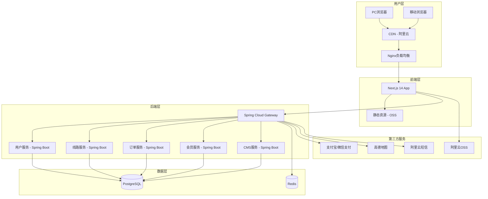

# Design Document

## Overview

漫骑游官方网站是一个高端跨界骑游生活平台的官方网站，采用「科技自然融合」的独特审美方向，融合德国血统E-BIKE技术与深度骑游体验。网站将展示五大骑游生活板块（租赁、线路、社群、好物、异业），并提供完整的会员系统、线路预订、在线支付等功能。

**访问权限说明**：未注册或未登录用户可以自由浏览网站所有展示内容（首页、线路、E-BIKE、好物、社群、合作等），仅在进行预订、支付、会员中心等操作时需要登录。

设计遵循SKILL指南，避免通用AI美学，打造独特、震撼、有记忆点的视觉体验。

## Architecture

### 系统架构图



### 技术栈选型

**前端技术栈**：
- Next.js 14 (App Router) - React框架，支持SSR/SSG
- TypeScript - 类型安全
- Tailwind CSS - 实用优先的CSS框架
- Framer Motion - React动画库
- shadcn/ui - 可定制的UI组件库
- Zustand - 轻量级状态管理
- React Query - 服务器状态管理
- React Hook Form + Zod - 表单处理和验证

**后端技术栈**：
- Java 17 - 编程语言
- Spring Boot 3.x - 后端框架
- Spring Security - 认证授权框架
- Spring Cloud Gateway - API网关
- MyBatis-Plus - ORM数据库操作
- PostgreSQL - 关系型数据库
- Redis - 缓存和会话管理
- Maven - 项目构建管理

**部署架构**：
- 阿里云ECS - 服务器
- 阿里云RDS - PostgreSQL数据库
- 阿里云OSS - 图片存储
- 阿里云CDN - 静态资源加速

## Components and Interfaces

### 前端组件架构

```
src/
├── app/                          # Next.js App Router
│   ├── (marketing)/              # 营销页面组（公开访问）
│   │   ├── page.tsx              # 首页
│   │   ├── about/                # 关于我们
│   │   ├── routes/               # 骑游线路
│   │   ├── ebike/                # E-BIKE产品
│   │   ├── goods/                # 在地好物
│   │   ├── community/            # 社群活动
│   │   ├── partners/             # 合作伙伴
│   │   └── contact/              # 联系我们
│   ├── (auth)/                   # 认证页面组
│   │   ├── login/                # 登录
│   │   └── register/             # 注册
│   ├── (dashboard)/              # 用户中心（需登录）
│   │   ├── profile/              # 个人信息
│   │   ├── orders/               # 我的订单
│   │   ├── membership/           # 会员中心
│   │   └── favorites/            # 我的收藏
│   ├── admin/                    # 管理后台（需管理员权限）
│   └── api/                      # API代理
├── components/
│   ├── ui/                       # 基础UI组件 (shadcn/ui)
│   ├── layout/                   # 布局组件
│   ├── marketing/                # 营销组件
│   ├── forms/                    # 表单组件
│   └── animations/               # 动画组件
├── lib/                          # 工具库
├── stores/                       # 状态管理
├── types/                        # 类型定义
└── styles/                       # 全局样式
```

### 后端服务架构（Java Spring Boot）

```
manqiyou-backend/
├── manqiyou-gateway/             # API网关服务
├── manqiyou-common/              # 公共模块
│   ├── common-core/              # 核心工具类
│   ├── common-security/          # 安全模块
│   └── common-redis/             # Redis模块
├── manqiyou-user/                # 用户服务
│   ├── src/main/java/
│   │   └── com/manqiyou/user/
│   │       ├── controller/       # 控制器
│   │       ├── service/          # 业务逻辑
│   │       ├── mapper/           # MyBatis映射
│   │       ├── entity/           # 实体类
│   │       └── dto/              # 数据传输对象
│   └── src/main/resources/
├── manqiyou-route/               # 线路服务
├── manqiyou-order/               # 订单服务
├── manqiyou-member/              # 会员服务
└── manqiyou-cms/                 # 内容管理服务
```


### 核心接口定义

```java
// 用户实体
@Data
@TableName("sys_user")
public class User {
    @TableId(type = IdType.ASSIGN_UUID)
    private String id;
    private String phone;
    private String nickname;
    private String avatar;
    private String wechatOpenId;
    private String memberLevelId;
    private Integer points;
    private LocalDateTime createdAt;
    private LocalDateTime updatedAt;
}

// 会员等级实体
@Data
@TableName("member_level")
public class MemberLevel {
    @TableId(type = IdType.ASSIGN_UUID)
    private String id;
    private String name;
    private Integer minPoints;
    private String benefits; // JSON数组
}

// 线路实体
@Data
@TableName("route")
public class Route {
    @TableId(type = IdType.ASSIGN_UUID)
    private String id;
    private String title;
    private String titleEn;
    private String subtitle;
    private String description;
    private String descriptionEn;
    private String images; // JSON数组
    private BigDecimal price;
    private String duration;
    private String difficulty; // easy, medium, hard
    private String highlights; // JSON数组
    private String categoryId;
    private Integer maxParticipants;
    private Boolean isActive;
    private LocalDateTime createdAt;
}

// 订单实体
@Data
@TableName("orders")
public class Order {
    @TableId(type = IdType.ASSIGN_UUID)
    private String id;
    private String orderNo;
    private String userId;
    private String routeId;
    private String scheduleId;
    private Integer participants;
    private BigDecimal totalPrice;
    private String status; // pending, paid, confirmed, completed, cancelled, refunded
    private String paymentMethod;
    private LocalDateTime paymentTime;
    private String contactName;
    private String contactPhone;
    private String remark;
    private LocalDateTime createdAt;
}
```

### API接口设计

```
# 公开接口（无需登录）
GET  /api/routes                  # 获取线路列表
GET  /api/routes/{id}             # 获取线路详情
GET  /api/routes/{id}/schedules   # 获取线路排期
GET  /api/categories              # 获取线路分类
GET  /api/content/banners         # 获取轮播图
GET  /api/content/news            # 获取新闻列表
GET  /api/goods                   # 获取好物列表
GET  /api/activities              # 获取活动列表

# 认证接口
POST /api/auth/send-code          # 发送验证码
POST /api/auth/login              # 手机号登录
POST /api/auth/wechat             # 微信登录
POST /api/auth/logout             # 退出登录
POST /api/auth/refresh            # 刷新Token

# 用户接口（需登录）
GET  /api/users/me                # 获取当前用户信息
PUT  /api/users/me                # 更新用户信息
GET  /api/users/me/orders         # 获取用户订单
GET  /api/users/me/points         # 获取积分记录
GET  /api/users/me/favorites      # 获取收藏列表
POST /api/users/me/favorites      # 添加收藏

# 订单接口（需登录）
POST /api/orders                  # 创建订单
GET  /api/orders/{id}             # 获取订单详情
POST /api/orders/{id}/pay         # 发起支付
POST /api/orders/{id}/cancel      # 取消订单

# 会员接口（需登录）
GET  /api/membership/levels       # 获取会员等级列表
POST /api/membership/redeem       # 积分兑换

# CMS接口（需管理员权限）
GET/POST/PUT/DELETE /api/admin/routes
GET/POST/PUT/DELETE /api/admin/orders
GET/POST/PUT/DELETE /api/admin/users
GET/POST/PUT/DELETE /api/admin/content
GET  /api/admin/statistics        # 数据统计
```

## Data Models

### 数据库表设计（PostgreSQL）

```sql
-- 用户表
CREATE TABLE sys_user (
    id VARCHAR(36) PRIMARY KEY,
    phone VARCHAR(20) UNIQUE,
    nickname VARCHAR(50),
    avatar VARCHAR(500),
    wechat_open_id VARCHAR(100) UNIQUE,
    member_level_id VARCHAR(36),
    points INTEGER DEFAULT 0,
    created_at TIMESTAMP DEFAULT CURRENT_TIMESTAMP,
    updated_at TIMESTAMP DEFAULT CURRENT_TIMESTAMP
);

-- 会员等级表
CREATE TABLE member_level (
    id VARCHAR(36) PRIMARY KEY,
    name VARCHAR(50) NOT NULL,
    min_points INTEGER NOT NULL,
    benefits JSONB
);

-- 线路分类表
CREATE TABLE route_category (
    id VARCHAR(36) PRIMARY KEY,
    name VARCHAR(100) NOT NULL,
    name_en VARCHAR(100),
    slug VARCHAR(100) UNIQUE NOT NULL,
    description TEXT
);

-- 线路表
CREATE TABLE route (
    id VARCHAR(36) PRIMARY KEY,
    title VARCHAR(200) NOT NULL,
    title_en VARCHAR(200),
    subtitle VARCHAR(500),
    description TEXT,
    description_en TEXT,
    images JSONB,
    price DECIMAL(10,2) NOT NULL,
    duration VARCHAR(50),
    difficulty VARCHAR(20),
    highlights JSONB,
    highlights_en JSONB,
    category_id VARCHAR(36) REFERENCES route_category(id),
    max_participants INTEGER DEFAULT 20,
    is_active BOOLEAN DEFAULT TRUE,
    created_at TIMESTAMP DEFAULT CURRENT_TIMESTAMP,
    updated_at TIMESTAMP DEFAULT CURRENT_TIMESTAMP
);

-- 线路排期表
CREATE TABLE route_schedule (
    id VARCHAR(36) PRIMARY KEY,
    route_id VARCHAR(36) REFERENCES route(id),
    schedule_date DATE NOT NULL,
    available_spots INTEGER NOT NULL
);

-- 订单表
CREATE TABLE orders (
    id VARCHAR(36) PRIMARY KEY,
    order_no VARCHAR(50) UNIQUE NOT NULL,
    user_id VARCHAR(36) REFERENCES sys_user(id),
    route_id VARCHAR(36) REFERENCES route(id),
    schedule_id VARCHAR(36) REFERENCES route_schedule(id),
    participants INTEGER NOT NULL,
    total_price DECIMAL(10,2) NOT NULL,
    status VARCHAR(20) DEFAULT 'pending',
    payment_method VARCHAR(20),
    payment_time TIMESTAMP,
    contact_name VARCHAR(50),
    contact_phone VARCHAR(20),
    remark TEXT,
    created_at TIMESTAMP DEFAULT CURRENT_TIMESTAMP,
    updated_at TIMESTAMP DEFAULT CURRENT_TIMESTAMP
);

-- 积分记录表
CREATE TABLE points_record (
    id VARCHAR(36) PRIMARY KEY,
    user_id VARCHAR(36) REFERENCES sys_user(id),
    amount INTEGER NOT NULL,
    type VARCHAR(10) NOT NULL, -- earn, spend
    source VARCHAR(50),
    description VARCHAR(200),
    created_at TIMESTAMP DEFAULT CURRENT_TIMESTAMP
);

-- 收藏表
CREATE TABLE favorite (
    id VARCHAR(36) PRIMARY KEY,
    user_id VARCHAR(36) REFERENCES sys_user(id),
    route_id VARCHAR(36) REFERENCES route(id),
    created_at TIMESTAMP DEFAULT CURRENT_TIMESTAMP,
    UNIQUE(user_id, route_id)
);

-- 内容管理表
CREATE TABLE content (
    id VARCHAR(36) PRIMARY KEY,
    type VARCHAR(50) NOT NULL, -- banner, news, activity
    title VARCHAR(200),
    title_en VARCHAR(200),
    content TEXT,
    content_en TEXT,
    images JSONB,
    is_active BOOLEAN DEFAULT TRUE,
    sort_order INTEGER DEFAULT 0,
    created_at TIMESTAMP DEFAULT CURRENT_TIMESTAMP,
    updated_at TIMESTAMP DEFAULT CURRENT_TIMESTAMP
);

-- 管理员表
CREATE TABLE admin (
    id VARCHAR(36) PRIMARY KEY,
    username VARCHAR(50) UNIQUE NOT NULL,
    password VARCHAR(200) NOT NULL,
    name VARCHAR(50),
    role VARCHAR(20) DEFAULT 'editor',
    created_at TIMESTAMP DEFAULT CURRENT_TIMESTAMP
);
```


## Correctness Properties

*A property is a characteristic or behavior that should hold true across all valid executions of a system-essentially, a formal statement about what the system should do. Properties serve as the bridge between human-readable specifications and machine-verifiable correctness guarantees.*

### Property 1: 公开内容访问权限
*For any* 未登录用户访问公开页面（首页、线路列表、线路详情、E-BIKE、好物、社群、合作），系统应正常返回内容，不要求登录
**Validates: Requirements 1.1, 2.1, 2.3, 3.4, 4.3, 5.2, 6.2, 7.3, 8.2**

### Property 2: 页面性能一致性
*For any* 页面请求，首屏加载时间应小于2秒，Lighthouse性能评分应大于90
**Validates: Requirements 1.1, 9.3, 11.1**

### Property 3: 响应式布局正确性
*For any* 视口宽度，网站应正确应用对应断点的布局样式（Mobile: 0-767px, Tablet: 768-1023px, Desktop: 1024-1439px, Large Desktop: 1440px+）
**Validates: Requirements 9.1, 9.2**

### Property 4: 图片资源管理正确性
*For any* 图片资源请求，系统应返回正确格式（WebP）和适当分辨率的图片；若加载失败，应显示占位图
**Validates: Requirements 9.5, 10.1, 10.2, 10.3, 10.4**

### Property 5: 线路数据展示一致性
*For any* 线路列表请求，返回的线路数据应包含完整的必要字段（标题、图片、价格、分类），且线路详情页应正确渲染所有数据
**Validates: Requirements 2.1, 2.3**

### Property 6: 导航系统完整性
*For any* 页面，应存在返回首页的入口、联系方式入口、面包屑导航（非首页），且导航结构符合信息架构设计
**Validates: Requirements 13.1, 13.3, 13.4**

### Property 7: 国际化切换正确性
*For any* 语言切换操作，页面应保持当前位置，所有可翻译内容应切换为目标语言，默认语言为中文
**Validates: Requirements 14.1, 14.3**

### Property 8: 表单提交流程正确性
*For any* 有效的表单提交，系统应返回成功响应并显示成功提示；对于无效输入，应显示明确的错误信息
**Validates: Requirements 15.4, 17.1, 17.3**

### Property 9: 用户认证状态一致性
*For any* 已登录用户，应显示用户中心入口和会员等级；对于未登录用户，需要认证的功能应引导登录，但不阻止浏览公开内容
**Validates: Requirements 16.3, 16.4, 16.5, 16.6**

### Property 10: 订单状态流转正确性
*For any* 订单，状态流转应遵循：pending → paid → confirmed → completed，或 pending → cancelled，或 paid → refunded
**Validates: Requirements 17.3, 17.5, 17.6, 17.7**

### Property 11: 积分系统一致性
*For any* 积分变动操作，应正确记录积分明细（来源、数量、时间），用户积分余额应等于所有积分记录的净值
**Validates: Requirements 18.1, 18.4, 18.5**

### Property 12: 会员等级升级正确性
*For any* 用户，其会员等级应与累计积分对应的等级一致，当积分达到升级阈值时应自动升级
**Validates: Requirements 18.4**

### Property 13: CMS内容管理CRUD正确性
*For any* 内容管理操作（创建、读取、更新、删除），操作结果应正确反映在数据库中，且前端应能正确获取最新数据
**Validates: Requirements 19.2, 19.3, 19.4, 19.5, 19.6**

### Property 14: 品牌视觉规范一致性
*For any* 页面，应使用品牌色彩体系（主色#0F4C3A、辅色#2A5FAD、点缀#D4AF37），字体应为指定的非通用字体
**Validates: Requirements 12.2, 12.3**

### Property 15: 线路预订库存一致性
*For any* 线路预订操作，可预订名额应实时更新，不应出现超卖情况
**Validates: Requirements 17.2**

## Error Handling

### 前端错误处理

```typescript
// 全局错误边界
class ErrorBoundary extends React.Component {
  state = { hasError: false, error: null };
  
  static getDerivedStateFromError(error) {
    return { hasError: true, error };
  }
  
  componentDidCatch(error, errorInfo) {
    // 上报错误到监控系统
    console.error('Error caught:', error, errorInfo);
  }
  
  render() {
    if (this.state.hasError) {
      return <ErrorFallback error={this.state.error} />;
    }
    return this.props.children;
  }
}

// 图片加载错误处理
const ImageWithFallback = ({ src, fallback, alt, ...props }) => {
  const [imgSrc, setImgSrc] = useState(src);
  const [hasError, setHasError] = useState(false);
  
  return (
     setHasError(true)}
      {...props}
    />
  );
};
```

### 后端错误处理（Java Spring Boot）

```java
// 统一响应格式
@Data
public class ApiResponse<T> {
    private Integer code;
    private String message;
    private T data;
    
    public static <T> ApiResponse<T> success(T data) {
        ApiResponse<T> response = new ApiResponse<>();
        response.setCode(200);
        response.setMessage("success");
        response.setData(data);
        return response;
    }
    
    public static <T> ApiResponse<T> error(Integer code, String message) {
        ApiResponse<T> response = new ApiResponse<>();
        response.setCode(code);
        response.setMessage(message);
        return response;
    }
}

// 全局异常处理
@RestControllerAdvice
public class GlobalExceptionHandler {
    
    @ExceptionHandler(BusinessException.class)
    public ApiResponse<?> handleBusinessException(BusinessException e) {
        return ApiResponse.error(e.getCode(), e.getMessage());
    }
    
    @ExceptionHandler(MethodArgumentNotValidException.class)
    public ApiResponse<?> handleValidationException(MethodArgumentNotValidException e) {
        String message = e.getBindingResult().getFieldErrors().stream()
            .map(FieldError::getDefaultMessage)
            .collect(Collectors.joining(", "));
        return ApiResponse.error(400, message);
    }
    
    @ExceptionHandler(Exception.class)
    public ApiResponse<?> handleException(Exception e) {
        log.error("系统异常", e);
        return ApiResponse.error(500, "服务器内部错误");
    }
}

// 业务异常类
public class BusinessException extends RuntimeException {
    private Integer code;
    
    public BusinessException(Integer code, String message) {
        super(message);
        this.code = code;
    }
}
```

## Testing Strategy

### 测试框架选择

**前端测试**：
- Vitest - 单元测试
- React Testing Library - 组件测试
- Playwright - 端到端测试
- fast-check - 属性测试

**后端测试**：
- JUnit 5 - 单元测试
- Mockito - Mock框架
- Spring Boot Test - 集成测试
- jqwik - Java属性测试库

### 测试层次

```
测试金字塔:
                    /\
                   /  \
                  / E2E \        (10%)
                 /--------\
                /   集成    \     (20%)
               /--------------\
              /     单元测试    \  (70%)
             /------------------\
```

### 属性测试示例（Java jqwik）

```java
// Property 11: 积分系统一致性
@Property(tries = 100)
void pointsBalanceEqualsNetRecords(
    @ForAll @Size(min = 1, max = 50) List<@IntRange(min = -1000, max = 1000) Integer> amounts
) {
    User user = new User();
    user.setPoints(0);
    
    int expectedBalance = 0;
    for (Integer amount : amounts) {
        if (amount >= 0) {
            pointsService.earnPoints(user, amount, "test");
            expectedBalance += amount;
        } else {
            int spendAmount = Math.min(-amount, user.getPoints());
            pointsService.spendPoints(user, spendAmount, "test");
            expectedBalance -= spendAmount;
        }
    }
    
    assertThat(user.getPoints()).isEqualTo(Math.max(0, expectedBalance));
}

// Property 10: 订单状态流转正确性
@Property(tries = 100)
void orderStatusTransitionsAreValid(
    @ForAll("validOrderStatus") String currentStatus,
    @ForAll("orderActions") String action
) {
    Order order = new Order();
    order.setStatus(currentStatus);
    
    String newStatus = orderService.transition(order, action);
    
    assertThat(isValidTransition(currentStatus, newStatus)).isTrue();
}

// Property 15: 线路预订库存一致性
@Property(tries = 100)
void availableSpotsNeverNegative(
    @ForAll @IntRange(min = 1, max = 50) int initialStock,
    @ForAll @Size(max = 20) List<@IntRange(min = 1, max = 10) Integer> bookings
) {
    RouteSchedule schedule = new RouteSchedule();
    schedule.setAvailableSpots(initialStock);
    
    for (Integer booking : bookings) {
        if (booking <= schedule.getAvailableSpots()) {
            bookingService.book(schedule, booking);
        }
    }
    
    assertThat(schedule.getAvailableSpots()).isGreaterThanOrEqualTo(0);
}
```

### 前端属性测试示例（fast-check）

```typescript
import * as fc from 'fast-check';

// Property 7: 国际化切换正确性
describe('Internationalization', () => {
  it('language switch preserves page position', () => {
    fc.assert(
      fc.property(
        fc.constantFrom('zh', 'en'),
        fc.integer({ min: 0, max: 1000 }),
        (targetLang, scrollPosition) => {
          const result = switchLanguage(targetLang, scrollPosition);
          return result.scrollPosition === scrollPosition && 
                 result.language === targetLang;
        }
      ),
      { numRuns: 100 }
    );
  });
});
```

### 测试覆盖率目标

| 类型 | 覆盖率目标 |
|------|-----------|
| 语句覆盖 | > 80% |
| 分支覆盖 | > 75% |
| 函数覆盖 | > 85% |
| 行覆盖 | > 80% |

### 属性测试配置

每个属性测试运行最少100次迭代。

测试标签格式：**Feature: manqiyou-website, Property {number}: {property_text}**
