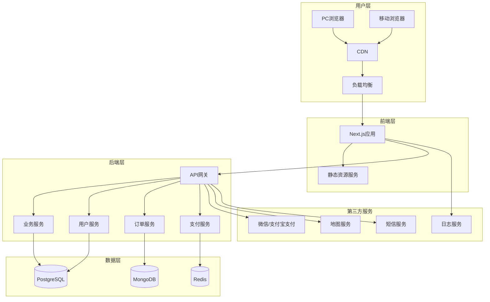
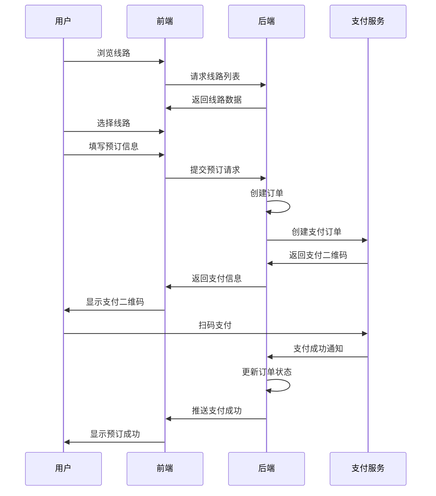
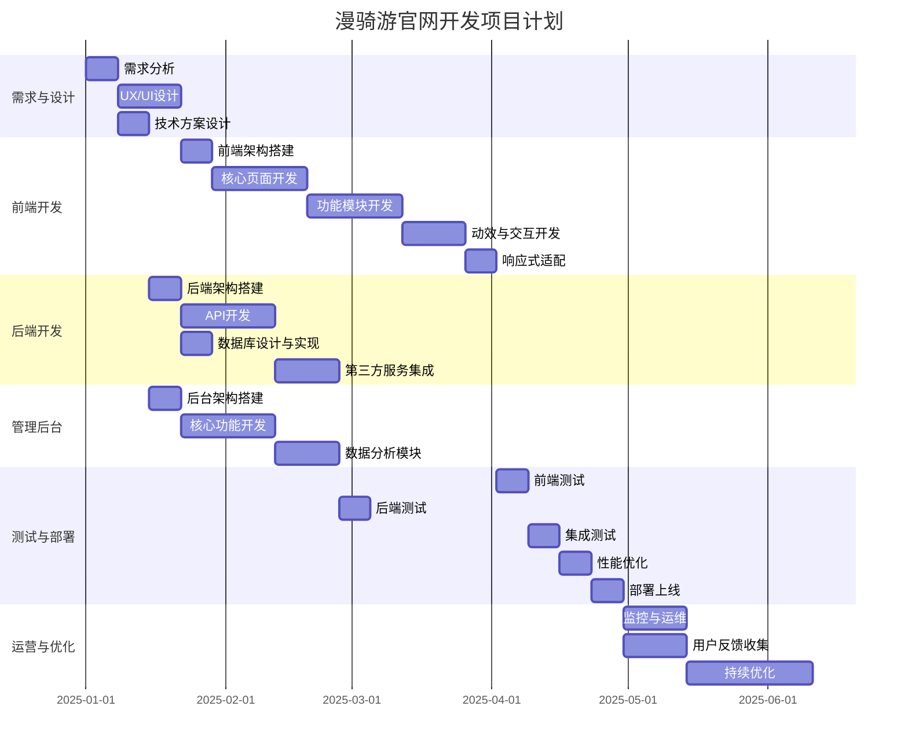

# 漫骑游官方网站开发全案说明书

> 版本：v1.0  
> 编制日期：2025-12-23  
> 编制人：资深全栈网站架构师与品牌战略顾问团队

---

## 目录

1. [项目背景](#1-项目背景)
2. [核心需求分析](#2-核心需求分析)
3. [品牌调性与设计策略](#3-品牌调性与设计策略)
4. [技术架构选型](#4-技术架构选型)
5. [功能模块规划](#5-功能模块规划)
6. [开发实施路线图](#6-开发实施路线图)
7. [风险评估与应对](#7-风险评估与应对)
8. [预算与资源配置](#8-预算与资源配置)

---

## 1. 项目背景

### 1.1 市场机遇

**万亿级市场风口**

- **E-BIKE市场**：2024年全球市场规模约400亿美元，2024-2029年预计复合年增长率达10.4%，2029年市场规模将突破700亿美元
- **体育消费市场**：2023年中国旅游市场规模达5.4万亿，2024年9月国务院印发《关于释放体育消费潜力意见》，力促2025年体育消费达5万亿规模
- **绿色低碳出行**：响应国家号召，践行绿色低碳出行理念

### 1.2 品牌定位

**漫骑游** 是一个集成德国血统E-BIKE和高端骑行旅游线路为核心的高端跨界骑游生活平台。

**核心使命**：骑遇无限美好人生

**品牌理念**：
- 以「骑遇无限美好人生」深度骑游线路开发为核心
- 链接在地好物、异业和社群社交
- 线上线下全场景打通
- 构建独特的会员机制
- 推动五大骑游生活板块不断迭代

### 1.3 商业模式

**三大核心战略**：

1. **产品服务化（Product Serviceization）**
   - 将「深度骑游线路」作为核心产品进行深度研发与设计
   - 线上APP + 线下生活馆
   - 整合线路上的「衣、食、住、行、乐」好物和异业
   - 提供一站式的深度骑游的超值体验

2. **服务平台化（Service Platformization）**
   - 构建六大功能事业部：运营创新中心、媒体中心、路线中心、资源中心、社群中心、销售中心
   - 立体赋能战略发展，助力加盟版图扩张

3. **收入多元化（Diversification of Income）**
   - 骑游线路服务费
   - E-BIKE租赁与销售
   - 联盟商家佣金
   - 会员服务费
   - 团队活动收益
   - 赛事收益
   - 在地好物销售提成

### 1.4 核心竞争优势

**技术优势**：
- 德国血统E-BIKE技术
- 途尔电助力自行车彻底解决深度探索与体力透支的根本矛盾
- 智能运营系统：扫码租车、无钥匙启动、GPS定位、智能电子中控锁
- 车身、人身双保险

**体验优势**：
- 线路设计融入当地文化、历史与自然
- 变「观光」为「深度体验」
- 整合骑乐无穷的跨界精神进阶目的地
- 身体骑乐无穷，精神进阶无限

**商业模式创新**：
- 政企合作模式：规划共制、资源共建、市场共拓、利益共享
- 异业跨界联盟：整合不同领域资源和服务
- 社群运营：把粉丝变成铁杆会员，甚至成为合伙人

### 1.5 发展愿景

以宁波为品牌运营中心和体验样板城市，走向安徽、海南、贵州等城市，未来覆盖全国，甚至走向世界。

**未来目标**：
- 上百个城市接入
- 上万条深度线路提供
- 无数的城市好物和异业联盟
- 为每个城市的文旅和体育生活赋能

---

## 2. 核心需求分析

### 2.1 目标用户画像

**核心用户群体**：

1. **高端旅游爱好者**（35-50岁，高净值人群）
   - 追求深度体验而非观光
   - 愿意为优质体验付费
   - 重视品质和服务

2. **环保出行倡导者**（25-45岁，中产阶级）
   - 关注绿色低碳生活方式
   - 科技接受度高
   - 社交媒体活跃

3. **户外运动社群**（28-45岁，社群领袖）
   - 骑行俱乐部成员
   - 户外爱好者
   - 有组织和带领活动能力

4. **商务团建客户**（企业HR/行政）
   - 寻找创新团建方式
   - 预算充足
   - 重视体验和品牌价值

### 2.2 用户核心需求

**功能需求**：
- 快速了解品牌和产品
- 浏览和预订骑游线路
- 查看E-BIKE租赁信息
- 了解会员体系和权益
- 查看在地好物推荐
- 加入社群和参与活动
- 联系客服和预约服务

**体验需求**：
- 视觉震撼、记忆深刻
- 操作流畅、直观易用
- 信息架构清晰、层次分明
- 移动端适配、随时随地访问
- 加载快速、性能优化
- 安全可靠、数据保护

### 2.3 商业需求

**获客转化**：
- 品牌展示和故事讲述
- 线索收集和用户注册
- 预订和支付功能
- 社交媒体分享

**会员运营**：
- 会员等级和权益展示
- 积分和奖励机制
- 专属活动和优惠
- 推荐邀请机制

**生态构建**：
- 异业合作展示
- 在地好物商城
- 社群活动发布
- 品牌加盟信息

**数据驱动**：
- 用户行为分析
- 转化漏斗追踪
- A/B测试支持
- SEO优化支持

### 2.4 技术需求

**性能要求**：
- 首屏加载 < 2秒
- Lighthouse 性能评分 > 90
- 移动端适配响应式设计
- 支持10万+并发访问

**安全要求**：
- HTTPS加密传输
- 用户数据隐私保护
- 支付安全集成
- 防SQL注入、XSS攻击

**可扩展性**：
- 微服务架构支持
- 云原生部署
- 容器化部署
- 自动化CI/CD

**维护性**：
- 代码规范和文档完善
- 模块化设计
- 易于内容更新
- 监控和日志系统

---

## 3. 品牌调性与设计策略

### 3.1 品牌调性定位

**设计方向选择**：**「精致奢华 × 科技未来 × 自然有机」**

根据SKILL设计指南，我们需要选择一个明确且大胆的审美方向。结合漫骑游的品牌特质，我们选择：

**「未来主义奢华骑游风格」**

这个调性融合了：
- **科技未来感**：体现E-BIKE的德国技术、智能运营系统
- **自然有机**：体现骑行旅游的户外、环保、健康理念
- **精致奢华**：体现高端、品质、服务的品牌定位

### 3.2 视觉语言策略

#### 3.2.1 色彩体系

**主色调**：
- **深森林绿** `#0F4C3A` - 代表自然、生态、可持续
- **科技蓝** `#2A5FAD` - 代表科技、创新、未来
- **奢华金** `#D4AF37` - 代表品质、高端、专属

**辅助色**：
- **天空蓝** `#87CEEB` - 代表自由、开放、探索
- **大地褐** `#8B4513` - 代表在地、文化、真实
- **活力橙** `#FF7F50` - 代表运动、激情、能量

**中性色**：
- **深灰** `#1A1A1A` - 用于文字和重要信息
- **浅灰** `#F5F5F5` - 用于背景和分割
- **纯白** `#FFFFFF` - 用于留白和呼吸空间

**渐变方案**：
```
主渐变：深森林绿 → 科技蓝
渐变代码：linear-gradient(135deg, #0F4C3A 0%, #2A5FAD 100%)
```

```
强调渐变：奢华金 → 活力橙
渐变代码：linear-gradient(90deg, #D4AF37 0%, #FF7F50 100%)
```

#### 3.2.2 字体系统

**遵循SKILL设计指南：选择独特、美丽、有趣的字体**

**中文字体选择**：
- **标题字体**：「思源黑体 Bold」或「阿里汉仪智能黑体 Heavy」
  - 特点：现代、有力、科技感
  - 用途：大标题、重要标题

- **副标题字体**：「思源宋体 Bold」或「方正书宋简体 Bold」
  - 特点：优雅、文化、品质
  - 用途：副标题、引用

- **正文字体**：「思源黑体 Regular」或「苹方 Regular」
  - 特点：易读、现代、简洁
  - 用途：正文、说明文字

- **装饰字体**：「汉仪小麦体」或「站酷高端黑」
  - 特点：独特、个性、记忆点
  - 用途：装饰性文字、标语

**英文字体选择**：
- **标题字体**：「Montserrat ExtraBold」或「Playfair Display Bold」
  - 特点：强烈、优雅、国际化
  - 用途：英文标题、品牌名称

- **正文/代码字体**：「Inter Medium」或「Roboto Mono」
  - 特点：现代、易读、科技
  - 用途：英文正文、技术说明

**字体层级规范**：

| 层级 | 字体 | 字号 | 字重 | 行高 | 字距 | 用途 |
|------|------|------|------|------|------|------|
| H1 | 思源黑体 Bold | 64px | 700 | 1.1 | -0.02em | 首页大标题 |
| H2 | 思源黑体 Bold | 48px | 700 | 1.2 | -0.01em | 章节标题 |
| H3 | 思源宋体 Bold | 32px | 700 | 1.3 | 0 | 小节标题 |
| H4 | 思源黑体 Medium | 24px | 500 | 1.4 | 0 | 卡片标题 |
| Body | 思源黑体 Regular | 16px | 400 | 1.6 | 0 | 正文 |
| Small | 思源黑体 Regular | 14px | 400 | 1.5 | 0 | 辅助文字 |
| Caption | 汉仪小麦体 | 12px | 400 | 1.4 | 0.05em | 装饰文字 |

#### 3.2.3 动效与交互策略

**遵循SKILL设计指南：使用动画创造效果和微交互**

**核心动效原则**：
- **精心编排的页面加载**：使用交错揭示（staggered reveals）创造惊喜
- **滚动触发动画**：随着滚动展示内容
- **悬停状态**：令人惊喜的交互反馈
- **高影响时刻**：一个精心编排的页面加载比分散的微交互更有效

**动效规划**：

1. **页面加载动效**
   - Hero区域：文字渐入 + 图片缩放 + 粒子效果
   - 时间延迟：每层元素0.2s延迟
   - 效果：营造「科技未来」的震撼感

2. **滚动触发动效**
   - 内容区域：元素从下方滑入
   - 图片：视差滚动效果
   - 数字：从0到目标数字的计数动画
   - 效果：引导用户浏览，增加参与感

3. **悬停交互动效**
   - 按钮：背景渐变 + 阴影放大
   - 卡片：上浮 + 阴影加深
   - 图片：放大 + 滤镜变化
   - 效果：提供清晰的交互反馈

4. **转场动效**
   - 页面切换：淡入淡出 + 滑动
   - 模态框：缩放 + 模糊背景
   - 效果：流畅的页面切换体验

**动画库选择**：
- **GSAP (GreenSock Animation Platform)**：专业级动画库，支持复杂时序
- **Framer Motion**：React动画库，声明式API
- **Lenis**：平滑滚动库，增强滚动体验

#### 3.2.4 空间布局策略

**遵循SKILL设计指南：意外的布局、不对称、重叠、对角流动、网格破坏**

**布局特色**：

1. **非对称布局**
   - 避免传统的左右对称
   - 使用黄金比例分割
   - 创造动态视觉平衡

2. **重叠元素**
   - 文字与图片重叠
   - 图形与内容重叠
   - 创造层次感和深度

3. **对角流动**
   - 元素沿对角线排列
   - 创造动感和流动感
   - 引导视觉流动

4. **网格破坏**
   - 部分元素跨越网格线
   - 打破常规布局
   - 创造视觉冲击

5. **负空间运用**
   - 慷慨的留白
   - 让内容「呼吸」
   - 突出核心信息

**网格系统**：
```
基础网格：12列
断点：
- Mobile: 1列 (0-767px)
- Tablet: 2列 (768-1023px)
- Desktop: 3列 (1024-1439px)
- Large Desktop: 4列 (1440px+)
```

#### 3.2.5 背景与视觉细节

**遵循SKILL设计指南：创造氛围和深度，而非默认的纯色背景**

**背景策略**：

1. **渐变网格背景**
   - 动态渐变色块
   - 柔和的色彩过渡
   - 创造科技感氛围

2. **噪点纹理叠加**
   - 细微的噪点效果
   - 增加质感
   - 避免过度平滑

3. **几何图案**
   - 六边形网格（呼应骑行）
   - 三角形、圆形元素
   - 创造节奏感

4. **阴影效果**
   - 柔和的投影
   - 多层阴影营造深度
   - 内阴影创造立体感

5. **装饰性边框**
   - 渐变边框
   - 虚线边框
   - 角标装饰

**视觉细节清单**：
- ✓ 渐变网格背景
- ✓ 噪点纹理叠加
- ✓ 几何图案装饰
- ✓ 柔和阴影系统
- ✓ 装饰性边框
- ✓ 自定义光标
- ✓ 粒子效果
- ✓ 视差滚动
- ✓ 动态渐变
- ✓ 玻璃拟态效果

### 3.3 用户体验（UX）策略

#### 3.3.1 信息架构

**网站地图结构**：

```
漫骑游官网
├── 首页
├── 关于我们
│   ├── 品牌故事
│   ├── 核心理念
│   └── 发展历程
├── 产品服务
│   ├── E-BIKE租赁
│   ├── 深度骑游线路
│   ├── 在地好物
│   └── 会员体系
├── 骑游线路
│   ├── 线路分类
│   ├── 热门推荐
│   ├── 定制服务
│   └── 线路详情页
├── 社群活动
│   ├── 活动日历
│   ├── 精彩瞬间
│   ├── 加入社群
│   └── 活动报名
├── 合作伙伴
│   ├── 政企合作
│   ├── 异业联盟
│   ├── 加盟城市
│   └── 合作申请
├── 新闻资讯
│   ├── 品牌动态
│   ├── 行业资讯
│   ├── 活动报道
│   └── 媒体关注
├── 联系我们
│   ├── 联系方式
│   ├── 在线留言
│   └── 门店导航
└── 用户中心
    ├── 我的订单
    ├── 我的会员
    ├── 个人信息
    └── 消息通知
```

#### 3.3.2 用户旅程设计

**新用户旅程**：

```
1. 首页浏览
   ↓
2. 了解品牌（关于我们）
   ↓
3. 浏览产品/服务
   ↓
4. 查看线路详情
   ↓
5. 注册/登录
   ↓
6. 预订/支付
   ↓
7. 等待出行
   ↓
8. 体验服务
   ↓
9. 分享评价
   ↓
10. 成为会员
```

**老用户旅程**：

```
1. 登录用户中心
   ↓
2. 查看订单/会员权益
   ↓
3. 浏览新线路/活动
   ↓
4. 预订/报名
   ↓
5. 邀请好友
   ↓
6. 参与社群
   ↓
7. 升级会员
```

#### 3.3.3 核心页面设计原则

**首页**：
- **Hero区域**：震撼的视觉冲击，清晰的价值主张
- **信任背书**：展示权威认证、合作伙伴
- **核心价值**：突出五大板块
- **行动号召（CTA）**：明确的下一步引导

**线路详情页**：
- **视觉优先**：高质量图片/视频展示
- **信息分层**：核心信息一目了然
- **预订便捷**：流畅的预订流程
- **社交证明**：用户评价、分享

**用户中心**：
- **信息清晰**：订单、会员、积分一目了然
- **操作便捷**：常用操作快速到达
- **个性化推荐**：基于历史行为的推荐

#### 3.3.4 响应式设计策略

**移动优先（Mobile First）**：

**断点策略**：
```
- Mobile (0-767px): 优先设计和开发
- Tablet (768-1023px): 响应式适配
- Desktop (1024-1439px): 桌面端优化
- Large Desktop (1440px+): 超大屏适配
```

**移动端优化**：
- 大按钮，易于点击
- 清晰的导航
- 简化的表单
- 快速加载
- 原生应用体验

**桌面端优化**：
- 丰富的视觉细节
- 悬停交互效果
- 更多的信息展示
- 多列布局
- 键盘导航支持

#### 3.3.5 无障碍设计（Accessibility）

**WCAG 2.1 AA级标准**：

**色彩对比度**：
- 文字与背景对比度 ≥ 4.5:1
- 大文字与背景对比度 ≥ 3:1
- 图形元素对比度 ≥ 3:1

**键盘导航**：
- 所有交互元素可通过键盘访问
- 清晰的焦点指示器
- Tab顺序符合逻辑

**屏幕阅读器支持**：
- 语义化HTML
- ARIA标签
- Alt文本

**其他**：
- 自动播放可暂停
- 闪烁元素 < 3次/秒
- 错误提示清晰
- 表单标签明确

---

## 4. 技术架构选型

### 4.1 整体架构设计

**架构图**：



### 4.2 前端技术栈

**核心框架**：

**Next.js 14 (App Router)**
- **选择理由**：
  - React框架，组件化开发
  - 服务端渲染（SSR）和静态生成（SSG）
  - 优秀的SEO支持
  - 内置优化（图片、字体、路由）
  - 强大的生态系统

**TypeScript**
- **选择理由**：
  - 类型安全
  - 更好的IDE支持
  - 减少运行时错误
  - 更易维护

**Tailwind CSS**
- **选择理由**：
  - 实用优先的CSS框架
  - 快速开发
  - 易于定制
  - 优秀的响应式支持

**组件库**：

**UI组件**：
- **shadcn/ui**：基于Radix UI的无头组件，可完全定制
- **选择理由**：
  - 高质量、可访问性
  - TypeScript支持
  - 可完全定制，符合品牌调性
  - 不使用「AI通用美学」

**动画库**：
- **Framer Motion**：React动画库
- **GSAP**：专业级动画
- **Lenis**：平滑滚动

**状态管理**：
- **Zustand**：轻量级状态管理
- **React Query (TanStack Query)**：服务器状态管理

**表单处理**：
- **React Hook Form**：高性能表单库
- **Zod**：Schema验证

**其他工具**：
- **next-themes**：主题切换（深色/浅色）
- **next-i18next**：国际化支持
- **Playwright**：端到端测试
- **Vitest**：单元测试

### 4.3 后端技术栈

**核心框架**：

**Node.js + Express** 或 **NestJS**
- **选择理由**：
  - JavaScript全栈
  - 与前端技术栈一致
  - 丰富的生态系统
  - 高性能

**NestJS**（推荐）：
- 企业级Node.js框架
- TypeScript原生支持
- 模块化架构
- 依赖注入
- 易于测试和维护

**API设计**：
- RESTful API
- GraphQL（可选，用于复杂查询）

**认证与授权**：
- **JWT (JSON Web Token)**
- **OAuth 2.0**（第三方登录）
- **RBAC (Role-Based Access Control)**

### 4.4 数据库选择

**关系型数据库**：
- **PostgreSQL**
  - 选择理由：
    - 开源、稳定、高性能
    - 支持复杂查询
    - JSON支持
    - 全文搜索

**非关系型数据库**：
- **MongoDB**
  - 选择理由：
    - 灵活的文档模型
    - 适合存储非结构化数据
    - 易于扩展

**缓存数据库**：
- **Redis**
  - 选择理由：
    - 高性能缓存
    - 会话存储
    - 消息队列

### 4.5 部署与运维

**云服务提供商**：
- **阿里云** 或 **腾讯云**（国内）
- **AWS** 或 **Google Cloud**（国际）

**容器化部署**：
- **Docker**：容器化
- **Kubernetes**：容器编排（可选，用于大规模部署）

**CI/CD**：
- **GitHub Actions** 或 **GitLab CI**
- 自动化测试、构建、部署

**监控与日志**：
- **Sentry**：错误监控
- **Datadog** 或 **New Relic**：性能监控
- **ELK Stack**：日志管理

**CDN**：
- **Cloudflare** 或 **阿里云CDN**
- 全球加速、静态资源分发

### 4.6 第三方服务集成

**支付服务**：
- **支付宝** / **微信支付** / **银联**

**地图服务**：
- **高德地图** / **百度地图**

**短信服务**：
- **阿里云短信** / **腾讯云短信**

**OSS存储**：
- **阿里云OSS** / **腾讯云COS**

**邮件服务**：
- **SendGrid** / **阿里云邮件推送**

**分析工具**：
- **Google Analytics 4**
- **百度统计**

---

## 5. 功能模块规划

### 5.1 核心功能模块

#### 5.1.1 首页模块

**功能清单**：
- Hero区域（视觉冲击 + 价值主张）
- 品牌介绍（核心故事）
- 五大板块展示
- 热门线路推荐
- 用户评价/案例
- 合作伙伴展示
- 新闻动态
- 页脚导航

**交互设计**：
- 滚动动画
- 视差效果
- 悬停交互
- 轮播/滑块

#### 5.1.2 产品服务模块

**子模块**：

**E-BIKE租赁**：
- 车型展示
- 规格参数
- 租赁价格
- 租赁流程
- 在线预订
- 服务网点

**深度骑游线路**：
- 线路分类
- 线路列表
- 线路详情
- 价格体系
- 预订流程
- 定制服务

**在地好物**：
- 商品分类
- 商品列表
- 商品详情
- 购物车
- 结算支付

**会员体系**：
- 会员等级
- 会员权益
- 积分规则
- 升级条件

#### 5.1.3 线路预订模块

**核心流程**：



**功能清单**：
- 线路搜索/筛选
- 线路详情展示
- 在线预订表单
- 支付集成
- 订单确认
- 订单管理

#### 5.1.4 用户中心模块

**核心功能**：

**个人信息管理**：
- 基本信息编辑
- 头像上传
- 密码修改
- 账号安全

**订单管理**：
- 订单列表
- 订单详情
- 订单状态追踪
- 订单取消/退款

**会员管理**：
- 会员等级展示
- 积分查询
- 优惠券管理
- 会员权益

**我的收藏**：
- 收藏的线路
- 收藏的商品
- 收藏的好物

**消息通知**：
- 系统消息
- 订单消息
- 活动通知

#### 5.1.5 社群活动模块

**功能清单**：

**活动发布**：
- 活动信息录入
- 活动图片上传
- 活动时间设置
- 报名人数限制

**活动展示**：
- 活动列表
- 活动日历
- 活动详情
- 精彩瞬间

**活动报名**：
- 在线报名
- 报名表单
- 支付费用（可选）
- 报名确认

**社群互动**：
- 活动讨论
- 照片分享
- 评价反馈

#### 5.1.6 合作伙伴模块

**子模块**：

**政企合作**：
- 合作模式介绍
- 成功案例
- 合作申请
- 联系方式

**异业联盟**：
- 合作伙伴展示
- 合作领域
- 加盟流程
- 在线申请

**加盟城市**：
- 已加盟城市
- 加盟优势
- 加盟支持
- 加盟申请

### 5.2 管理后台模块

#### 5.2.1 内容管理（CMS）

**功能清单**：
- 页面内容编辑
- 图片/视频管理
- 文章/新闻发布
- 轮播图管理
- Banner管理

#### 5.2.2 线路管理

**功能清单**：
- 线路创建/编辑
- 线路分类管理
- 线路上架/下架
- 价格管理
- 库存管理

#### 5.2.3 订单管理

**功能清单**：
- 订单列表
- 订单详情
- 订单状态管理
- 退款处理
- 数据导出

#### 5.2.4 用户管理

**功能清单**：
- 用户列表
- 用户详情
- 用户等级管理
- 用户行为分析
- 黑名单管理

#### 5.2.5 会员管理

**功能清单**：
- 会员列表
- 会员等级设置
- 积分规则配置
- 优惠券发放
- 会员活动管理

#### 5.2.6 财务管理

**功能清单**：
- 收入统计
- 支出统计
- 财务报表
- 对账管理
- 发票管理

#### 5.2.7 数据分析

**功能清单**：
- 访问统计
- 转化漏斗
- 用户画像
- 销售分析
- 热门线路
- 地域分布

#### 5.2.8 系统设置

**功能清单**：
- 系统配置
- 权限管理
- 日志管理
- 备份恢复

### 5.3 移动端适配

**响应式设计**：
- 所有页面移动端适配
- 触摸优化
- 移动端专属功能

**PWA支持（可选）**：
- 离线访问
- 桌面图标
- 推送通知

### 5.4 SEO优化

**技术SEO**：
- 语义化HTML
- Meta标签优化
- 结构化数据（Schema.org）
- 站点地图（XML Sitemap）
- Robots.txt配置

**内容SEO**：
- 关键词研究
- 页面标题优化
- 元描述优化
- URL结构优化
- 内链策略

**性能SEO**：
- 页面加载速度优化
- 图片优化
- 代码压缩
- CDN加速

---

## 6. 开发实施路线图

### 6.1 项目阶段划分



### 6.2 详细时间计划

**第1-2周：需求与设计阶段**

**第1周**：
- ✓ 项目启动会议
- ✓ 需求调研和分析
- ✓ 竞品分析
- ✓ 用户画像定义

**第2周**：
- ✓ 信息架构设计
- ✓ 用户流程设计
- ✓ 原型设计（低保真）
- ✓ 原型评审与确认

**第3-4周：UX/UI设计阶段**

**第3周**：
- ✓ 设计风格定义
- ✓ 视觉系统设计（色彩、字体、图标）
- ✓ 高保真原型设计
- ✓ 交互动效设计

**第4周**：
- ✓ 所有页面设计
- ✓ 响应式设计规范
- ✓ 设计稿交付
- ✓ 设计评审与确认

**第5-14周：前端开发阶段**

**第5周**：
- ✓ 前端架构搭建
- ✓ 开发环境配置
- ✓ 组件库搭建
- ✓ 基础样式开发

**第6-8周（核心页面开发）**：
- ✓ 首页开发
- ✓ 关于我们页面开发
- ✓ 产品服务页面开发
- ✓ 骑游线路页面开发
- ✓ 用户中心页面开发

**第9-11周（功能模块开发）**：
- ✓ 线路预订功能开发
- ✓ 用户注册/登录功能开发
- ✓ 会员功能开发
- ✓ 社群活动功能开发
- ✓ 支付功能集成

**第12-13周（动效与交互）**：
- ✓ 页面加载动效
- ✓ 滚动触发动画
- ✓ 悬停交互效果
- ✓ 页面转场动画
- ✓ 平滑滚动集成

**第14周（响应式适配）**：
- ✓ 移动端适配
- ✓ 平板端适配
- ✓ 跨浏览器测试
- ✓ 性能优化

**第15-20周：后端开发阶段**

**第15周**：
- ✓ 后端架构搭建
- ✓ 数据库设计
- ✓ API网关搭建
- ✓ 认证授权系统

**第16-18周（API开发）**：
- ✓ 用户API开发
- ✓ 线路API开发
- ✓ 订单API开发
- ✓ 支付API开发
- ✓ 会员API开发

**第19-20周（第三方集成）**：
- ✓ 支付服务集成
- ✓ 地图服务集成
- ✓ 短信服务集成
- ✓ 邮件服务集成
- ✓ OSS存储集成

**第21-25周：管理后台开发**

**第21周**：
- ✓ 后台架构搭建
- ✓ 基础框架搭建
- ✓ 权限管理系统

**第22-24周（核心功能）**：
- ✓ 内容管理（CMS）
- ✓ 线路管理
- ✓ 订单管理
- ✓ 用户管理
- ✓ 会员管理

**第25周（数据分析）**：
- ✓ 数据统计模块
- ✓ 报表生成
- ✓ 可视化图表

**第26-30周：测试与部署**

**第26周（前端测试）**：
- ✓ 单元测试
- ✓ 集成测试
- ✓ 端到端测试
- ✓ 性能测试

**第27周（后端测试）**：
- ✓ 单元测试
- ✓ API测试
- ✓ 压力测试
- ✓ 安全测试

**第28周（集成测试）**：
- ✓ 前后端联调
- ✓ 功能测试
- ✓ 兼容性测试
- ✓ 用户体验测试

**第29周（性能优化）**：
- ✓ 前端性能优化
- ✓ 后端性能优化
- ✓ 数据库优化
- ✓ CDN配置

**第30周（部署上线）**：
- ✓ 生产环境部署
- ✓ 域名配置
- ✓ SSL证书配置
- ✓ 监控配置
- ✓ 备份配置

**第31-34周：运营与优化**

**第31-32周**：
- ✓ 监控系统运行
- ✓ 收集用户反馈
- ✓ Bug修复
- ✓ 小功能优化

**第33-34周**：
- ✓ 数据分析
- ✓ A/B测试
- ✓ 功能迭代
- ✓ 性能调优

### 6.3 里程碑节点

| 里程碑 | 时间节点 | 交付物 | 验收标准 |
|--------|----------|--------|----------|
| M1: 需求确认 | 第2周 | 需求规格说明书 | 需求文档评审通过 |
| M2: 设计确认 | 第4周 | UI/UX设计稿 | 设计稿评审通过 |
| M3: 核心功能完成 | 第11周 | 核心功能代码 | 功能测试通过 |
| M4: 前端完成 | 第14周 | 前端代码 + 文档 | 前端验收通过 |
| M5: 后端完成 | 第20周 | 后端代码 + 文档 | 后端验收通过 |
| M6: 后台完成 | 第25周 | 后台代码 + 文档 | 后台验收通过 |
| M7: 测试完成 | 第28周 | 测试报告 | 所有测试通过 |
| M8: 上线发布 | 第30周 | 线上系统 | 系统稳定运行 |

### 6.4 团队配置

**核心团队**：

| 角色 | 人数 | 职责 |
|------|------|------|
| 项目经理 | 1 | 项目管理、进度控制、风险管理 |
| 技术架构师 | 1 | 技术方案设计、架构评审 |
| 前端开发工程师 | 2 | 前端开发、动效实现 |
| 后端开发工程师 | 2 | 后端开发、API开发 |
| UI/UX设计师 | 1 | 设计、原型、交互设计 |
| 测试工程师 | 1 | 测试、质量保证 |
| 运维工程师 | 1 | 部署、运维、监控 |

**合计**：8人

### 6.5 沟通机制

**会议机制**：
- **每日站会**：15分钟，同步进度、问题、计划
- **周会**：每周五，总结本周工作、规划下周工作
- **里程碑评审会**：每个里程碑节点，评审交付物
- **技术评审会**：关键技术决策时召开

**文档机制**：
- **需求文档**：详细的功能需求、非功能需求
- **设计文档**：UI/UX设计稿、交互说明
- **技术文档**：架构设计、API文档、数据库设计
- **测试文档**：测试计划、测试用例、测试报告
- **运维文档**：部署文档、运维手册

**协作工具**：
- **项目管理**：Jira / Trello / 飞书
- **代码管理**：GitLab / GitHub
- **文档协作**：Notion / 飞书文档
- **设计协作**：Figma / Sketch
- **沟通工具**：飞书 / 钉钉 / 企业微信

---

## 7. 风险评估与应对

### 7.1 项目风险

#### 7.1.1 技术风险

**风险1：技术选型不当**
- **影响**：项目延期、性能问题、维护困难
- **概率**：中等
- **应对措施**：
  - 技术评审会，充分论证
  - POC（概念验证）验证
  - 咨询技术专家

**风险2：性能不达标**
- **影响**：用户体验差、SEO影响
- **概率**：中等
- **应对措施**：
  - 性能目标量化
  - 持续性能监控
  - 性能优化专项
  - CDN加速

**风险3：安全漏洞**
- **影响**：数据泄露、用户信任受损
- **概率**：低
- **应对措施**：
  - 安全编码规范
  - 定期安全审计
  - 渗透测试
  - 漏洞扫描

#### 7.1.2 进度风险

**风险1：需求变更**
- **影响**：项目延期、成本增加
- **概率**：高
- **应对措施**：
  - 需求冻结机制
  - 变更控制流程
  - 预留缓冲时间
  - 敏捷开发方法

**风险2：技术难点攻克时间长**
- **影响**：进度延期
- **概率**：中等
- **应对措施**：
  - 提前识别难点
  - 技术预研
  - 专家支持
  - 备选方案

**风险3：人员变动**
- **影响**：知识流失、进度延迟
- **概率**：低
- **应对措施**：
  - 文档完善
  - 代码评审
  - 知识共享
  - 培养备选人员

#### 7.1.3 质量风险

**风险1：Bug过多**
- **影响**：用户体验差、维护成本高
- **概率**：中等
- **应对措施**：
  - 代码评审
  - 单元测试
  - 集成测试
  - 端到端测试

**风险2：用户体验不佳**
- **影响**：转化率低、用户流失
- **概率**：中等
- **应对措施**：
  - 用户测试
  - A/B测试
  - 用户反馈收集
  - 迭代优化

#### 7.1.4 运营风险

**风险1：流量激增导致系统崩溃**
- **影响**：服务中断、品牌受损
- **概率**：低
- **应对措施**：
  - 弹性伸缩
  - 负载均衡
  - 限流降级
  - 容灾备份

**风险2：第三方服务故障**
- **影响**：功能不可用
- **概率**：低
- **应对措施**：
  - 服务降级
  - 备选方案
  - 监控告警
  - 快速响应

### 7.2 风险矩阵

| 风险类别 | 风险项 | 概率 | 影响 | 优先级 | 应对措施 |
|----------|--------|------|------|--------|----------|
| 技术风险 | 技术选型不当 | 中 | 高 | 高 | 技术评审、POC验证 |
| 技术风险 | 性能不达标 | 中 | 高 | 高 | 性能监控、优化专项 |
| 技术风险 | 安全漏洞 | 低 | 高 | 中 | 安全审计、渗透测试 |
| 进度风险 | 需求变更 | 高 | 中 | 高 | 需求冻结、变更控制 |
| 进度风险 | 技术难点 | 中 | 中 | 中 | 技术预研、专家支持 |
| 进度风险 | 人员变动 | 低 | 中 | 低 | 文档完善、知识共享 |
| 质量风险 | Bug过多 | 中 | 中 | 中 | 测试覆盖、代码评审 |
| 质量风险 | 用户体验 | 中 | 高 | 高 | 用户测试、A/B测试 |
| 运营风险 | 流量激增 | 低 | 高 | 中 | 弹性伸缩、负载均衡 |
| 运营风险 | 第三方故障 | 低 | 中 | 低 | 降级方案、备选服务 |

### 7.3 应急预案

**场景1：关键Bug导致系统崩溃**
1. 立即回滚到上一稳定版本
2. 召开紧急会议分析原因
3. 快速修复并测试
4. 验证后重新上线
5. 总结经验，优化流程

**场景2：性能严重下降**
1. 启动性能监控分析
2. 识别性能瓶颈
3. 实施临时优化方案
4. 长期优化计划
5. 持续监控

**场景3：数据泄露**
1. 立即启动应急响应
2. 通知受影响用户
3. 调查泄露原因
4. 修复安全漏洞
5. 加强安全措施

---

## 8. 预算与资源配置

### 8.1 人力成本

| 角色 | 人数 | 月薪（万元） | 月数 | 小计（万元） |
|------|------|--------------|------|--------------|
| 项目经理 | 1 | 3.5 | 8 | 28.0 |
| 技术架构师 | 1 | 4.5 | 6 | 27.0 |
| 前端开发工程师 | 2 | 2.5 | 7 | 35.0 |
| 后端开发工程师 | 2 | 2.5 | 6 | 30.0 |
| UI/UX设计师 | 1 | 2.0 | 2 | 4.0 |
| 测试工程师 | 1 | 1.8 | 4 | 7.2 |
| 运维工程师 | 1 | 2.0 | 6 | 12.0 |
| **合计** | **8** | - | - | **143.2** |

### 8.2 技术服务成本

| 项目 | 说明 | 费用（万元） |
|------|------|--------------|
| 域名 | .com域名 + 备案 | 0.05 |
| 云服务器 | 阿里云ECS（8核16G x 2） | 1.2 |
| 数据库 | PostgreSQL云数据库 | 0.8 |
| CDN | 阿里云CDN | 0.6 |
| OSS存储 | 阿里云OSS | 0.5 |
| 短信服务 | 阿里云短信 | 0.3 |
| 支付接口 | 支付宝/微信支付 | 0.1 |
| 地图服务 | 高德地图API | 0.2 |
| 监控服务 | Sentry + Datadog | 0.6 |
| 第三方组件 | shadcn/ui Pro等 | 0.2 |
| **合计** | - | **4.55** |

### 8.3 其他成本

| 项目 | 说明 | 费用（万元） |
|------|------|--------------|
| 设计素材 | 图标、字体、图片等 | 2.0 |
| 测试设备 | 多设备测试 | 1.0 |
| 培训费用 | 技术培训 | 1.0 |
| 备用金 | 应急使用 | 5.0 |
| **合计** | - | **9.0** |

### 8.4 总预算

| 类别 | 金额（万元） | 占比 |
|------|--------------|------|
| 人力成本 | 143.2 | 91.6% |
| 技术服务 | 4.55 | 2.9% |
| 其他成本 | 9.0 | 5.8% |
| **总计** | **156.75** | **100%** |

### 8.5 资源配置计划

**硬件资源**：
- 开发机：每人1台高性能笔记本
- 测试机：多品牌、多系统测试设备
- 服务器：生产环境服务器

**软件资源**：
- 开发工具：VS Code、Git、Docker等
- 设计工具：Figma、Sketch等
- 协作工具：Jira、Notion、飞书等

**网络资源**：
- 办公网络：高速稳定网络
- VPN：远程访问支持

### 8.6 成本优化建议

1. **人力成本优化**：
   - 核心团队全职，辅助团队按需
   - 合理利用外包资源
   - 加强培训，提升效率

2. **技术成本优化**：
   - 选择性价比高的云服务
   - 合理规划资源，避免浪费
   - 使用开源软件降低成本

3. **流程优化**：
   - 敏捷开发，快速迭代
   - 自动化测试，减少人工成本
   - 持续优化，提高效率

---

## 附录

### A. 术语表

| 术语 | 英文 | 解释 |
|------|------|------|
| E-BIKE | Electric Bicycle | 电助力自行车 |
| CMS | Content Management System | 内容管理系统 |
| CTA | Call To Action | 行动号召 |
| POC | Proof of Concept | 概念验证 |
| CDN | Content Delivery Network | 内容分发网络 |
| SEO | Search Engine Optimization | 搜索引擎优化 |
| UX | User Experience | 用户体验 |
| UI | User Interface | 用户界面 |
| API | Application Programming Interface | 应用程序接口 |
| PWA | Progressive Web App | 渐进式Web应用 |

### B. 参考资料

1. **品牌资料**：
   - 漫骑游品牌手册
   - SKILL设计指南

2. **技术文档**：
   - Next.js官方文档
   - Tailwind CSS文档
   - PostgreSQL文档
   - Redis文档

3. **设计资源**：
   - Figma资源
   - Dribbble设计灵感
   - Behance优秀案例

### C. 联系方式

**项目联系人**：
- 项目负责人：[姓名]
- 技术负责人：[姓名]
- 设计负责人：[姓名]

**沟通渠道**：
- 项目群：[飞书/钉钉群]
- 邮件：[邮箱地址]
- 电话：[联系电话]

---

**文档版本历史**

| 版本 | 日期 | 修订人 | 修订内容 |
|------|------|--------|----------|
| v1.0 | 2025-12-23 | 架构师团队 | 初始版本 |

---

**声明**

本文档为漫骑游官方网站开发项目的初步规划方案，具体实施过程中可能根据实际情况进行调整。最终方案以双方确认的技术规格书为准。

---

© 2025 漫骑游品牌运营中心. All rights reserved.